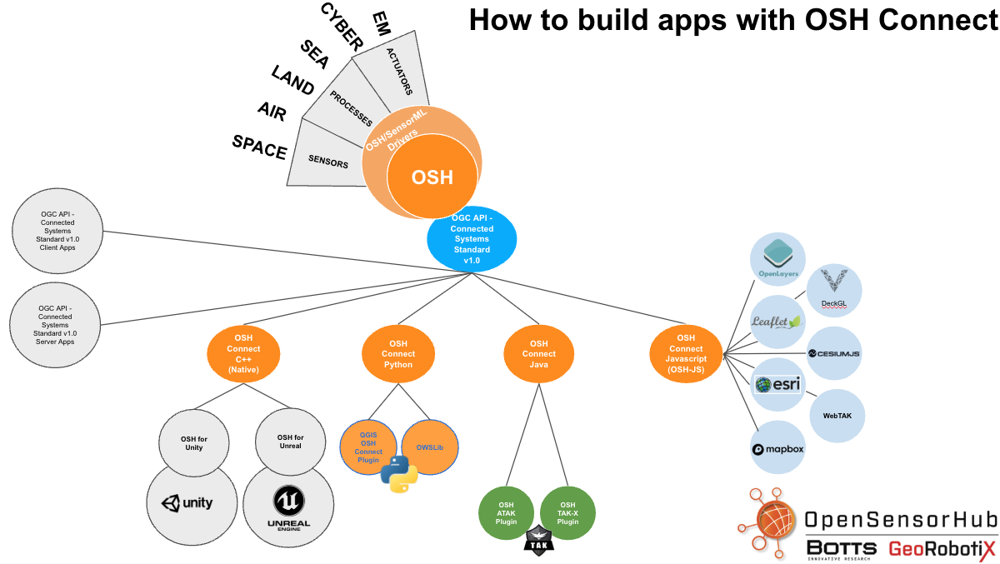

# Introduction to OSHConnect

OSHConnect is a family of client application libraries intended to provide a simple and straightforward way to interact with OpenSensorHub nodes via the [OGC API - Connected Systems](https://ogcapi.ogc.org/connectedsystems/) interface. You can learn more about how to use Connected Systems in our [Connected Systems hands on guide](/docs/osh-connect/connected-systems).

Below is an overview of the support for OSHConnect across C++, Python, Java, and JavaScript.

:::info
Generic instructions will be given for both the Python and Java libraries. OSH-JS is the precursor to OSHConnect-JavaScript. If you want instructions specific to the JavaScript toolkit, please refer to the [JavaScript Toolkit guide](osh-js/introduction)
:::

--- 

:::info
If you are interested in the StarUML diagrams for OSHConnect, you can find them [here](https://drive.google.com/file/d/1FVrnYiuAR8ykqfOUa1NuoMyZ1abXzMPw/view)
:::