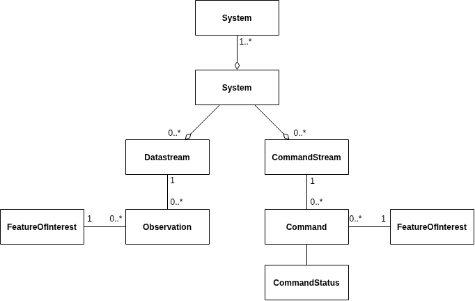

# Core Data Model

OpenSensorHub (OSH) internals are modeled on a few key concepts defined by the SensorML (opens new window), 
O&M/OMS (opens new window)and SWE Common (opens new window)standards. 
This page covers detailed descriptions of these concepts and some facts regarding their implementation in OSH.

Below is a simplified diagram showing the main data model components and a discussion about each class. 
We feel that it's important to read through these definitions so you can better understand how data is organized by OSH, and find your way around the OSH admin console.

## System
**Systems** are entities that can **produce observation data** and/or **receive command data**. 
A system can be a **physical entity** (e.g. sensors, actuators, devices, and even humans or other living things acting as sensors) 
or a **logical entity** (e.g. processing components, forecast models, etc.) but, 
in both cases, detailed information about it (the specsheet) can be provided in the **SensorML** language.

In OSH, systems can be further categorize using the following classes defined by [W3C SSN](https://www.w3.org/TR/vocab-ssn/) standard ontology:

- [Platform](https://www.w3.org/TR/vocab-ssn/#SOSAPlatform)
- [Sensor](https://www.w3.org/TR/vocab-ssn/#SOSASensor)
- [Actuator](https://www.w3.org/TR/vocab-ssn/#SOSAActuator)
- [Sampler](https://www.w3.org/TR/vocab-ssn/#SOSASampler)

A system's **SensorML specsheet** provides a thorough description of its **inputs, outputs and parameters**, 
but also information regarding its identification, classification, contacts, physical and measurement characteristics, etc. 
Each description also has a certain **validity period** (valid time) which allows for **full historization** of the system metadata 
(e.g. allows to capture and historize information about maintenance events like software updates or recalibrations, physical device deployments and relocations, etc.).

Systems can also be **parameterized**, either statically (via configuration) or dynamically (via tasking). 
Both types of parametrization can be self-described in the **SensorML** description.

A system can be a **data producer**, in which case it has one or more **outputs** that represent data feeds generated by the system. 
These data flows can include **observation results**, but also other things such as **status information**. 
Each **output** has a unique name (in the system scope) and is associated to a **structure** (a.k.a. schema) and **encoding**. 
Data records generated by an output are collected into a **Datastream** (see below). 
OSH also supports output schema changes over time.

A system can also be a **command receiver**, in which case it has one or more **taskable parameters** that represent commands or messages that can be received by the system. 
Similarly to outputs, each taskable parameter (or group of parameters) has a unique name (in the system scope) and is associated to a schema. 
Commands sent to the system and targeted at a specific taskable parameter must abide by its schema or the command is rejected. 
Commands sent to a system are collected into **Command Streams** (see below) and can be automatically persisted.

**Systems** can be nested by nature, meaning that a system can incorporate other subsystems. 
This can be used to model complex systems and all their components in great details, such as entire machines or robots or sensor networks/arrays.
## Datastream
**Datastreams** are time series of **Observations** of the same kind that are generated by a given system. 
By "same kind" we mean that the **result** of all **Observations** in a given datastream share the same **structure** (i.e. abide to the same schema) and **encoding**.

In OSH, datastreams are always associated to a **system output**. 
If the schema of an **output** changes, a new **datastream** is created, and in this case, there will be several datastreams associated to the same output, each one with a different validity period.

**Datastreams** can be seen as the **realtime channel** through which data flows, or as a **collection of historical observations** over time. 
In fact, in OSH, a datastream represents both and allows for both methods of data consumption: real-time streaming or retrieval of historical data. 
Depending on how the acquisition pipeline for a particular system is configured, data records collected by a datastream can be discarded as soon as dispatched by the 
**Event Bus** (realtime datastream) or they can be persisted in a **Data Store** (historical datastream), or both.

## Observation
Observations are a specific type of event, where a **System** observes, estimates or forecasts the value of one or more properties of a **Feature of Interest**. 
Each observation is associated to a **Datastream**, that in turn is associated to a specific **output** of the **System** that made the observation. 
Observations also have the following properties:

### Phenomenon Time
Observations have a **phenomenon time** that indicates **when the phenomenon being observed (or forecasted) took place**. 
Note that the phenomenon time is not necessarily in the present: it can be in the past if the system observes something that happened long ago (e.g. a geological or astronomical event), or in the future when the system produces a forecast (e.g. forecast model).
### Result Time
Observations also have a **result time** that indicates the **time at which the system generated the observation result**. 
It can be different from the phenomenon time (e.g. in the case of a forecast).
:::info
For most types of automated/digital sensors, **phenomenon time and result time can be considered identical** because their difference is often mere sensor latency.
This latency of a few milliseconds is usually neglected, but can be documented in the **SensorML** description if needed.
:::
### Result
In OSH, **observation results** are always defined by a SWE Common data structure and encoding, both of which are self-descriptive and can be retrieved by data consumers before they start consuming data from an OSH node.
## Feature of Interest
The **Feature of Interest** (often abbreviated as **FOI**) represents the object or phenomenon whose properties (or state) are observed, estimated or forecasted by a **system**. 
Capturing this information is essential to **link the measured data to the real world**.
:::info
**Examples of features of interest:**
- A static geospatial feature such as a building, a river, a lake, an atmospheric layer
- A mobile object such as a vehicle or a person
- An artifact collected on the field and studied in a lab such as a rock sample
:::
In some cases, the feature of interest is a **Sampling Feature**, that is called this way because it **samples a larger feature**, often called the **domain feature** or more generally the **sampled feature**. 
The **Sampling Feature** always references the **domain feature** so that one can query measurements associated to the larger feature, which is usually the one of ultimate interest.
:::info
**Examples of sampling features:**
- A measurement station along a river (sampling feature = station location, sampled feature = the river)
- A specific room or location inside a building
- A specimen of a larger rock formation
:::
A given system can have **one or several features of interest**, and these features of interest can be observed at the same time or at different times.
:::info
**Examples of systems and their FOIs:**
- A stationary in-situ sensor typically observes a single feature of interest that doesn't change over time (or rarely changes).
- A mobile remote sensor (i.e. whose location and/or orientation can change) usually targets a single feature of interest at a time, but may target different features of interest over time.
- A sensor network targets multiple features of interest simultaneously
- A fleet of mobile sensors can target multiple features of interest simultaneously, all of which can change over time
:::
OSH APIs and internal models are designed to implement and document all cases described above.
## Command Stream
**Command Streams** are the counterparts of datastreams that are used to model systems' **command & control channels**. They are thus used to augment **Systems** with **tasking capabilities**.

A **command stream** is essentially a time series of **commands** associated to a **taskable parameter** of a given system.
**Commands** are often low-level instructions, but they can be further combined into **tasks**, which provide higher level functionality, 
managed by OSH, such as scheduling, batching and priority handling.

If the schema of a **taskable parameter** changes, a new **command stream** is created, and in this case, 
there will be several command streams associated to the same taskable parameter, each one with a different validity period. 
Commands can only be posted to a command stream that is currently valid.

Like **Datastreams**, **Command Streams** represent both the **realtime channel** through which commands are delivered and the **collection of historical commands** that a system has received over time.

As explained above, OSH has both concepts of **Commands** and **Tasks**. **Commands** are usually executed immediately (although asynchronously) 
by the receiver while **Tasks** can take longer to execute and can be scheduled for execution at a later time. 
A **Task** consists of a sequence of one or more **Commands** to be executed at a given priority level. 
A **Task** can also be used to reserve one or more **command channels** for exclusive access during a well-defined time period. 
Tasks with a higher priority level can override an already executing or scheduled task.