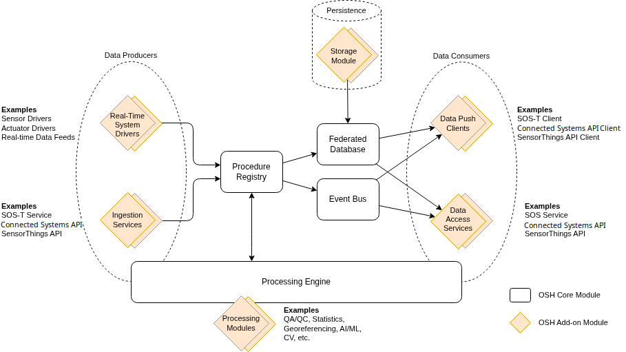

# Overview

OpenSensorHub's (OSH) modular and flexible architecture allows solving many different use cases related to sensor data collection, harmonization, processing and distribution/sharing.

OSH core components implement a generic data model and an efficient streaming and historical data management engine that can accommodate any sensor type, 
while add-on modules provide specific functionality, tailored to specific use cases or sensor kinds.

The main OSH components are shown on the following diagram:

## Core Components
The following components are part of the core engine and are thus present in all OSH deployments
### Event Bus
The **Event Bus** enables **asynchronous one-to-many messaging** between components via a **publish/subscribe** paradigm. 
This is an essential component of OSH since many things in OSH are event-based and reactive.
### Federated Database
The **Federated Database** is a unified queryable interface allowing access to all data stored by OSH storage modules.

It allows data consumers such as services and APIs to obtain their data in a unified manner. 
This is true for any storage type and/or any number of underlying storage backends that are used to persist and historize data.
### System Registry
The **System Registry** is a management component for modules adding new Systems 
(e.g. sensors, actuators, sensor networks, processes) to an OSH node, such a sensor drivers.

In particular, the **System Registry** handles the following aspects:

- System state management (across restarts)
- Validation and forwarding of events produced by data producers to the event bus
- Dispatching of new events to the event bus when state changes are detected
- Reception of commands and distribution to the target system
- Automatic persistence of metadata (with full historization) and real-time data/commands (configurable)
### Processing Engine
The **Processing Engine** provides functionality to **execute processing** chains in different modes:

- **Stream processing mode** to process real-time data flows (observations) into other derived data flows
- **On-demand processing mode** to process data on-demand, when triggered by an external action (typically when requested from a service interface)
- **Batch processing mode** to process or re-process archived data in batch

Processing chains are made of atomic processing components that are provided as add-ons.
## Addon Components
Addon components can be included at build time in a given OSH node distribution, or they can be installed later using the dynamic deployment features built on OSGi.
### Realtime System Drivers
**Realtime System Drivers** are addons implementing the System Driver API and responsible for pushing real-time (or quasi real-time) data into OSH by adapting a data feed coming from external sources. 
Drivers can be:

- Sensor/device drivers connecting directly to a physical device such as a sensor, an actuator, a digital system of any kind.
- Data feed drivers connecting to a network data feed in a non SWE format, e.g.
  - A Kafka feed flowing proprietary data.
  - An AVL data feed over TCP produced by an existing AVL data aggregation system.
  - A video data feed produced by a network camera.
  - etc.
### Database Connector Modules
Any type of datastore can be used to persist data generated by OSH if the proper connector, implementing OSH Datastore API, is developed. 
Virtually all kinds of storage backends can be supported, for example:

- Embedded object databases (e.g. H2 MVStore, Perst)
- SQL databases (e.g. PostgreSQL, SQLite, Oracle)
- Distributed NoSQL data stores (e.g. Elasticsearch, MongoDB)
- Proxies for remote data stores (e.g. proprietary web services or APIs providing access to observation archives)
- File collections (e.g. NetCDF files)
- etc.

A single OSH node can be configured with multiple databases, possibly mixing different kinds of storage backends. 
This provides full flexibility when a single hub is used to aggregate several existing data sources that are in their own legacy datastore. 
It also allows the administrator to pick the best database implementation for a given kind of dataset (e.g. think of specialized databases for video or point clouds for instance).

As we said previously, the Federated Database is read-only. This means that writing must be done by connecting directly to a specific database. 
Any OSH module that requires writing information to the OSH persistence layer is typically associated to one of the configured databases via configuration.

For examples, transactional web services and API typically write to a specific database, that can be either be dedicated to that service or shared among multiple services. 
However, **System Drivers** typically don't require a direct connection to the database, but rather delegate this job to the System Registry.
### Processing Modules
**Processing Modules** provide one or more processing components that can be run standalone or as part of a larger **processing chain**. 
Processing modules can easily be created and added to an OSH node by implementing the **Processing API** to solve problems such as:

- Statistics and data summarizations
- Quality assurance and control (QA/QC)
- Geolocalization and other geospatial computations
- Artificial Intelligence and Machine Learning (AI/ML)
- Computer Vision and Video Processing (CV)
- etc.

**Processing Modules** can be developed in pure Java or can wrap existing libraries developed in other languages (e.g. OpenCV, OpenAI, TensorFlow, Orekit, etc.)

### External Services
**External APIs and Services** provide communication interfaces allowing the exchange of data in and out of an OSH node.

Several **HTTP based APIs and services** are provided either as part of OSH Core or maintained by the core team:

- OGC Sensor Observation Service (SOS), including transactional support (SOS-T)
- OGC Sensor Planning Service (SPS) and our custom extension for registering a remotely taskable sensor (SPS-T)
- Connected Systems API
- SensorThings API

**MQTT bindings** are also available for publishing and subscribing to real-time data as an extension to both **Connected Systems API** and **SensorThings API**.

Many more can be developed as addons such as the video transcoding services.