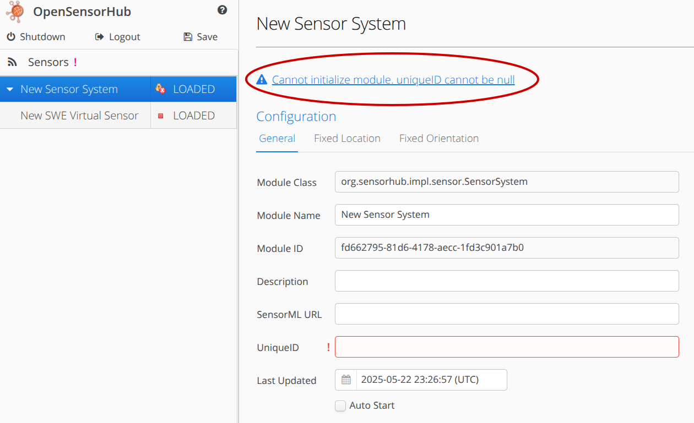
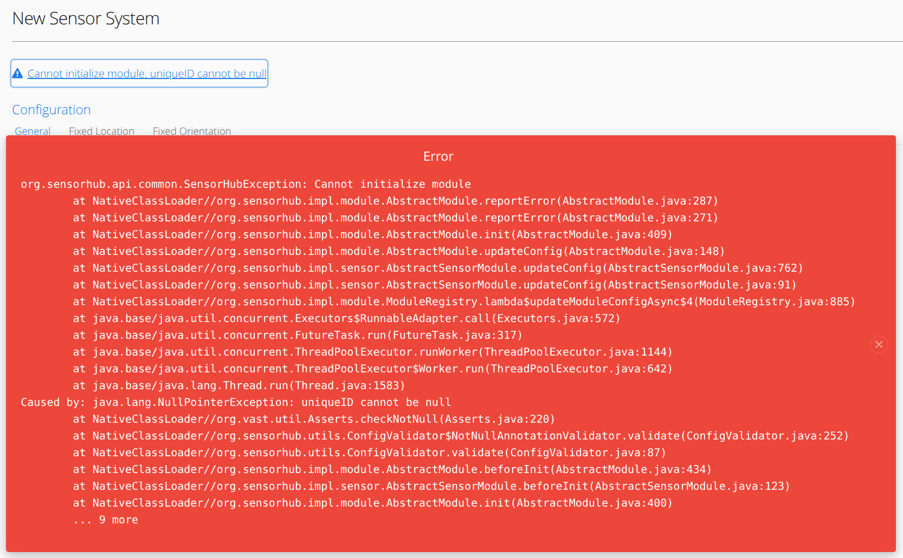
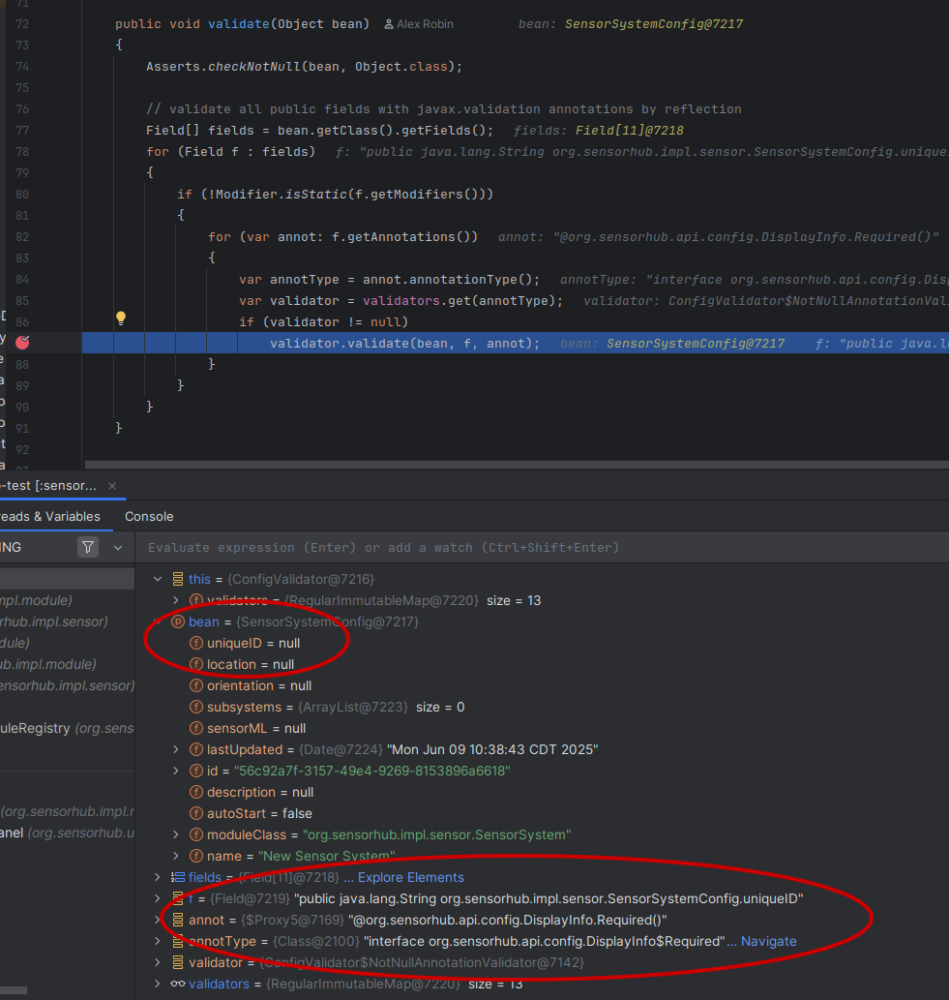

## Stack Traces

Stack traces are important for understanding **what** error occurred, and **where** it occurred.

Fatal errors will display stack traces in **OpenSensorHub's Admin UI**,
and **always** in the terminal/logs.

Example error:

Stack trace from error (in Admin UI):

As you can see, usually the `Exception` thrown will contain a helpful message for debugging your application.

### Debugging

If this message is not helpful, you may also see that the stack trace prints **where** the error occurred.
If we navigate to one of the higher-level files/methods before the exception is thrown,
we can set a breakpoint to see what happens right before the error.

:::tip
Please see the OSH [Debugging Guide](../debugging.md) to set up and use a debugger.
:::

For this example, we saw that `AbstractModule.beforeInit()` is called a few levels before the `NullPointerException` is thrown.

We can step through this method and find where the module configuration is validated.

Below you may see that the configuration field `uniqueID` is being validated.
This field has the annotation `DisplayInfo.Required`, so it must not be blank/null.
Therefore, we can assume the error is happening because the `uniqueID` field is null.

This is the most efficient way to resolve an unknown error.