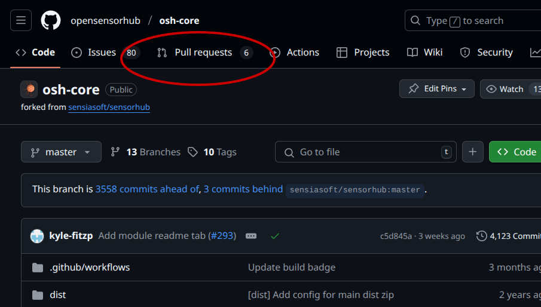
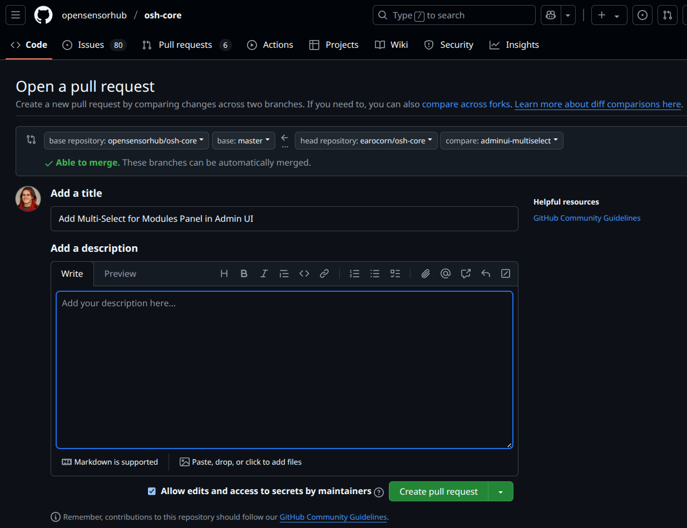

# Contribution Guide
If you want to contribute, we feel the best way is that you create your own fork on [GitHub](https://github.com/opensensorhub), 
work on it, and when you have something working and tested, send us a Pull Request (click for [GitHub's PR guide](https://docs.github.com/en/pull-requests/collaborating-with-pull-requests/proposing-changes-to-your-work-with-pull-requests/creating-a-pull-request)). 
To set this up, please follow the steps below:

## Contribution Steps
For sake of simplicity, this guide will assume you are using the `osh-node-dev-template` repository (see [Development Template Guide](dev-template.md)).

The `osh-node-dev-template` repository contains submodules for `osh-addons` (addon modules), and `osh-core` (the core OSH modules).

If you are changing or adding a feature to the core of **OpenSensorHub**,
you should be forking `OpenSensorHub/osh-core`, and creating Pull Requests targeting `OpenSensorHub/osh-core`.

For creating addon modules (drivers, processes, services, and other modules), you should fork and create PRs targeting `OpenSensorHub/osh-addons`
### Fork GitHub Repository
The first step is to fork a repo by clicking the [Fork](https://docs.github.com/en/pull-requests/collaborating-with-pull-requests/working-with-forks/fork-a-repo) button on GitHub. 
This will clone the original code to your own GitHub account so you can then modify it and/or add to it as you wish. 
For this you'll need to have a GitHub account (it can be done in 30s using your email address) and log into it.

Forking the project this way will allow you to send us [Pull Requests](https://docs.github.com/en/pull-requests/collaborating-with-pull-requests/proposing-changes-to-your-work-with-pull-requests/about-pull-requests) 
via GitHub which makes it much easier for us to incorporate your contribution to the master branch. 
In addition, it creates a community around the software and lets others see what contributors are up to even before a patch is submitted. 
This can help you get the proper guidance when necessary.
### Modify Submodule Origin
In order to make changes and test them, we need to modify our development environment to use the forked submodule(s).

This assumes that you:
- are using `osh-node-dev-template` (or similarly structured repository) for development.
- created a fork of `osh-addons` and/or `osh-core`.

Example of modifying and fetching new origin for `osh-addons`
```
# Navigate to development directory
cd /osh-node-dev-template/include/osh-addons

# Following should print `https://github.com/opensensorhub/osh-addons.git`
git remote get-url origin

# Set origin to your fork
git remote set-url origin https://github.com/<username>/osh-addons.git

# Following should now print `https://github.com/<username>/osh-addons.git`
git remote get-url origin 

# Fetch the new origin
git fetch origin 
```

The above will modify your `osh-node-dev-template` to now use your fork of `osh-addons`.
### Make Changes
After setting up your repository, 
it is useful to **make a new branch** for the new feature/module you wish to implement.

```shell /osh-node-dev-template/include/osh-addons
git checkout -b my-new-feature
```

Here, you can make your changes to the respective repository.
Please be clear and concise when making/documenting your changes.

Be sure to [test](unit-testing.md) and **document** your code to ensure a swift and easy review process!

:::info
Whether you're trying to fix bugs or adding new functionality, 
don't hesitate to tell us early-on what you're planning to work on. 
We may be able to point you in the right direction or maybe to somebody who has similar needs to you.
:::
### Pull Request
When you have finalized your changes and tested them in **OpenSensorHub**,
you can create a Pull Request targeting the corresponding repository.



In the **Pull Requests** tab, select **New pull request**.
You'll have to choose the right **base repository** and **head repository** for GitHub to know where you are merging from/to.

:::tip
**Base Repository** - The repository into which changes are being merged (OpenSensorHub/...)

**Head Repository** - Your fork/branch containing the changes.
:::



After configuring your base and head repositories, please add a meaningful title and extensive description that notes:
- What was changed
- Why the change was made
- How (or what) you tested, if applicable
