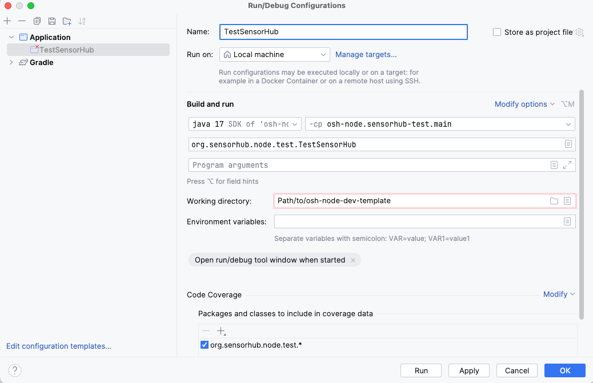

## Setup and Run Debugger for OSH in IntelliJ

These are instructions on how to run the debugger for an OSH Node in IntelliJ
- Allows you to build and run an OSH node without having to go through the process of full build, unzip, launch and configure. 
- The OSH Node will build and run in the IDE with a `config.json` that can be saved between builds.
- Allows for breakpoints to be utilized in driver and core code for insight into issues with drivers and other modules. 

## SensorHub Test Module
- Open your project directory, and check if your project contains the `sensorhub-test` module under `/osh-node-dev-template/tools/sensorhub-test`.

### Edit the build.gradle
- In the `sensorhub-test` module, edit the `build.gradle` to include the drivers/processes/modules you want in the debug node.

### Add debug task
We can either add the debug task manually with configuration shown below.

Or you can follow these steps in your IDE:
- Navigate to the `TestSensorHub` class in the `sensorhub-test` directory. Within that class, there should be several green arrows. These indicate runnable classes/methods.
- Right-click on the `main` method inside `TestSensorHub` and select `Run 'TestSensorHub.main()'`.

After following these steps, a new debug task configuration should be updated in your IDE.

### Set Breakpoints
- Open the source of any driver or module that you included in the `sensorhub-test`'s `build.gradle` of which you want to inspect the execution. 
- Click on any line number where you want to pause the execution and add a breakpoint (a red dot should appear).

### Modify and Rerun
- Any changes made to the driver code can be rebuilt within IntelliJ without the need to go through a full build, unzip, and launch process.
- After any modifications, restart the debug session to apply changes and continue testing. 

### Checking Endpoint
- The `sensorhub-test` default port is 8282. To navigate to the `Admin Panel` you can open any supported browser, and go to `http://localhost:8282/sensorhub/admin` and follow the steps to configure a module 
<!-- [here](LINK).  -->