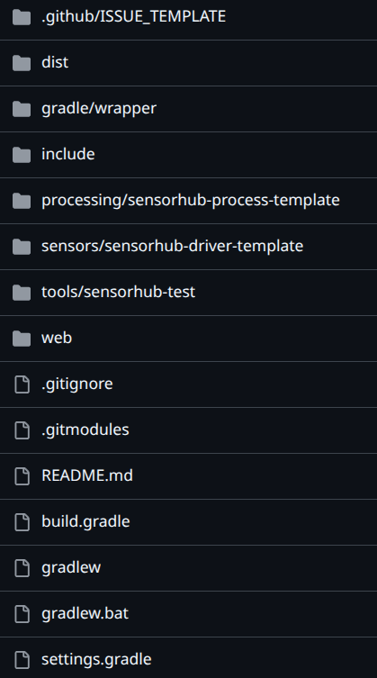

# Setting up Node Development Template

## Requirements 
- Java 17+
- Gradle 7.3+
- Git

## The Code
The following clones the **OpenSensorHub** node development template.
```git 
git clone --recursive https://github.com/opensensorhub/osh-node-dev-template.git
```
:::note
The `--recursive` flag is required because the repository contains submodules.
:::

### What's Included
Below is everything included in `osh-node-dev-template`, along with a table explaining each file/directory.



| File/Directory         | Purpose                                                                                                                                                       |
|------------------------|---------------------------------------------------------------------------------------------------------------------------------------------------------------|
| .github/ISSUE_TEMPLATE | Issue templates to create GitHub issues.                                                                                                                      |
| dist/config            | Config files required in a build. All config files from here will be output in the build's `config` directory as specified in the root `build.gradle`         |
| dist/scripts           | Scripts to launch the built node (and perform other setup). These will be included in the build at the built node's root directory.                           |
| gradle/wrapper         | Configuration for using Gradle Wrapper, which is used for building an OSH node. Here you may update the Gradle Wrapper version to use Java 21+.               |
| include/osh-addons     | Additional OSH modules that can be used as dependencies for your modules or built with the OSH node. These include drivers, processes, services, etc.         |
| include/osh-core       | Core modules required for an OSH node to work. These modules include the source code for an OSH node, and APIs for creating additional modules.               |
| processing             | Local processing modules. A template for a SensorML process is included in this directory.                                                                    |
| sensors                | Local sensor driver modules. A template for a simulated sensor driver is included in this directory.                                                          |
| tools/sensorhub-test   | A test module to be used with a debugger, for running a node and any drivers, processes, or other modules in debug mode. Please see [Debugging](debugging.md) |
| web                    | Static web files to be served by the built OSH node. This directory will be included in the built node under `web`.                                           |
| build.gradle           | Gradle build configuration. This is where you will define what submodules to build, the distribution structure, and other basic configuration.                |
| settings.gradle        | This is where you declare all dependencies to be used by submodules and modules built by `build.gradle`.                                                      |
| gradlew                | Executable for performing Gradle tasks. To build (without running tests), use `./gradlew build -x test`.                                                      |

:::tip
When creating a sensor driver, process, or other module, be sure to move your module to `include/osh-addons` and create pull requests targeting **OpenSensorHub**/osh-addons on the `master` branch.
Please refer to the [Contribution Guide](contributing.md).
:::
## Building
Use Gradle Wrapper to build.
```gradlew
./gradlew build -x test
```
This will build an OSH node in `osh-node-dev-template/build/distributions/osh-node-*.*.*.zip`.

Upon unzipping you will find configuration files in `/config`, launch scripts, all built modules as JAR files in `/lib`, static web files in `/web`, and a few more files included in a build.