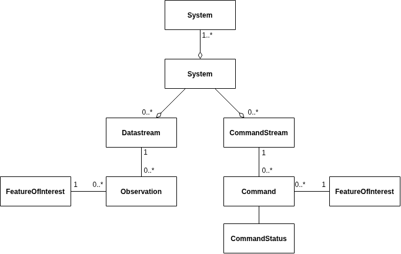

## Overview
**OpenSensorHub** is designed to allow connectivity between any kind of database (H2, SQL, NoSQL, distributed DBMS, etc.).
A database in OSH is a module that handles a **data store** to persist OSH core data models (systems, features, datastreams etc.),
and historical data produced from **data-producing modules** (system drivers, processes, services).

Core functionalities of **OpenSensorHub** will not change based on the type of database being used.
All databases within OSH are treated as they are the same, with the **federated database** used to aggregate different data stores.

## Federated Database
The **federated database** is a central OSH component that allows aggregating multiple storage types and make them accessible to other hub components via a unified interface.

This means OSH can be configured to store data from different sensors in different **data stores** and still provide a unified view of all data collected. 
This is particularly useful for aggregating data from several OSH nodes into some sort of central catalog and is shown conceptually on the following diagram:


**Data store** is meant here in the general sense of the term, 
so it can be any type of persistent store, including (but not limited) to relational databases, 
object databases, data repositories accessed remotely via web services, files on a filesystem, etc.
## Database Registry
The **database registry** manages all persistence modules loaded on an OSH hub. 
It then instantiates a **federated database** facade to provide unified access to all persistent data and act as a mediator between historical data producers and consumers. 
This is shown on the figure below:


For this integration to be possible, all database modules must conform to the **OSH database API**. 
Each module (whether it implements a local database such as an embedded database, or connects to a remote database) must use this API.
## Federated IDs
When several data stores are used together, each of them typically generates its own unique IDs (i.e. primary keys)
separately, so there is no guarantee that these IDs are unique globally. 
In order to avoid potential ID conflicts, the **federated database** must thus provide a way to generate its own identifiers and guarantee their uniqueness.

This is done by assigning each database a number in OSH and letting the **database registry** and the **federated database** handle the mapping between public IDS and internal IDs.

Public IDs are the only ones visible and used by data consumers. 
All queries sent to the **federated database** must use these public IDs.
Internal IDs are the ones used inside each datastore.

## Database API
We can infer from the [OSH Core Data Model](../../architecture/core-data-model.md) (see diagram below) 
that an OSH database requires a way to store these core data model components.


### Observation System Databases
The database used to store data related to one or more *System* instances,
(including system descriptions, observations, commands, and features of interest)
will implement `IObsSystemDatabase`.

This **observation system database** provides full data store capabilities of the entire **OSH core data model**.
Therefore, if you want to create a database module for handling a new type of database,
it is recommended to start here.

### Database Module Development
To create a new **database module** in OSH, developers should implement the `IObsSystemDatabaseModule` interface 
(see <a href="/reference/javadoc/org/sensorhub/api/database/IObsSystemDatabaseModule.html" target="_blank"> API Reference</a>) from the `osh-core` APIs.

```java title="IObsSystemDatabaseModule.java"
public interface IObsSystemDatabaseModule<ConfigType extends DatabaseConfig> extends IObsSystemDatabase, IModule<ConfigType> {}
```

This interface uses some key OSH APIs:
- `IModule` - Manage module lifecycle (e.g. `init`/`start` for database setup and `stop` for database cleanup)
- `IDatabase` - Common database transaction and access functionality
- `IObsSystemDatabase` - Access to data stores to persist OSH core data model components

#### Data Stores
Creating a new OSH database module requires implementation of data stores to persist the OSH core data model.

`IObsSystemDatabase` describes which data stores are required and their corresponding interface for data store implementation.

The implementation of a **data store** requires methods to be implemented for querying, adding, removing, updating items, as well as other common methods for data/database interaction.

| Data Store Type                    | Interface                                                                                                                          |
|------------------------------------|------------------------------------------------------------------------------------------------------------------------------------|
| System Descriptions/History        | <a href="/reference/javadoc/org/sensorhub/api/datastore/system/ISystemDescStore.html" target="_blank"> ISystemDescStore</a>        |
| Feature Of Interests               | <a href="/reference/javadoc/org/sensorhub/api/datastore/feature/IFoiStore.html" target="_blank"> IFoiStore</a>                     |
| Historical Observations            | <a href="/reference/javadoc/org/sensorhub/api/datastore/obs/IObsStore.html" target="_blank"> IObsStore</a>                         |
| Data Streams/History               | <a href="/reference/javadoc/org/sensorhub/api/datastore/obs/IDataStreamStore.html" target="_blank"> IDataStreamStore</a>           |
| Historical Commands                | <a href="/reference/javadoc/org/sensorhub/api/datastore/command/ICommandStore.html" target="_blank"> ICommandStore</a>             |
| Command Streams/History            | <a href="/reference/javadoc/org/sensorhub/api/datastore/command/ICommandStreamStore.html" target="_blank"> ICommandStreamStore</a> |
| Status Logs of Historical Commands | <a href="/reference/javadoc/org/sensorhub/api/datastore/command/ICommandStatusStore.html" target="_blank"> ICommandStatusStore</a> |
| Deployment Descriptions/History    | <a href="/reference/javadoc/org/sensorhub/api/datastore/deployment/IDeploymentStore.html" target="_blank"> IDeploymentStore</a>    |

## Interacting with Databases
Developers can interact directly with a database (if database is known), or they can use the **federated database** to query data across all databases. 

However, we must note that the **federated database is read-only**.
Still, an OSH node's **database registry** can be used to get a particular database by its **database number** or **module id**.

```java
ISensorHub hub = getParentHub(); // any module's parent ISensorHub instance
hub.getDatabaseRegistry().getObsDatabaseByModuleID("module12345"); // by module id
hub.getDatabaseRegistry().getObsDatabaseByNum(4); // by database number
hub.getDatabaseRegistry().getFederatedDatabase(); // getting federated database
```

Likewise, an OSH node's **system registry** can be used to get a system's handler database by the system UID.

```java
ISensorHub hub = getParentHub();
hub.getSystemDriverRegistry().getDatabase("urn:osh:sensor:simulated:001");
```

Direct access to a database allows access to data stores of the database.
Through these data stores, you can query, add, remove, or update resources in the database.

Querying, removing, and updating can be done directly by using the resource ID.

```java
IObsSystemDatabase db = hub.getDatabaseRegistry().getObsDatabaseByNum(4); // some known database
FeatureKey systemKey = new FeatureKey(new BigIdLong(5, 1234)); // some resource key
// highlight-start
db.getSystemDescStore().put(systemKey, new SystemWrapper(newSystem));
var item = db.getSystemDescStore().get(systemKey);
db.getSystemDescStore().remove(systemKey);
// highlight-end
```

However, it is often recommended to use **filters** for optimized queries and batch resource deletion.
### Filters
Each resource in the OSH core data model has a unique `Filter` for filtering results from a database query. 

Below is a table with the different resource filters, and links to their API reference.
I highly encourage you to explore the API reference for all information on the specific filters.

Some example queries on the **federated database** will also be provided, using different types of filters.

:::info
Each filter can be created by using the corresponding `FilterBuilder` (e.g. `SystemFilterBuilder`, `DataStreamFilterBuilder`, etc.).
:::

| Filter Type                   | FilterBuilder                                                                                                                                                       |
|-------------------------------|---------------------------------------------------------------------------------------------------------------------------------------------------------------------|
| System Filter                 | <a href="/reference/javadoc/org/sensorhub/api/datastore/system/SystemFilter.SystemFilterBuilder.html" target="_blank">SystemFilterBuilder</a>                       |
| Feature Of Interests Filter   | <a href="/reference/javadoc/org/sensorhub/api/datastore/feature/FoiFilter.FoiFilterBuilder.html" target="_blank">FoiFilterBuilder</a>                               |
| Historical Observation Filter | <a href="/reference/javadoc/org/sensorhub/api/datastore/obs/ObsFilter.ObsFilterBuilder.html" target="_blank">ObsFilterBuilder</a>                                   |
| Data Stream Filter            | <a href="/reference/javadoc/org/sensorhub/api/datastore/obs/DataStreamFilter.DataStreamFilterBuilder.html" target="_blank">DataStreamFilterBuilder</a>              |
| Historical Command Filter     | <a href="/reference/javadoc/org/sensorhub/api/datastore/command/CommandFilter.CommandFilterBuilder.html" target="_blank">CommandFilterBuilder</a>                   |
| Command Stream Filter         | <a href="/reference/javadoc/org/sensorhub/api/datastore/command/CommandStreamFilter.CommandStreamFilterBuilder.html" target="_blank">CommandStreamFilterBuilder</a> |
| Command Status Filter         | <a href="/reference/javadoc/org/sensorhub/api/datastore/command/CommandStatusFilter.CommandStatusFilterBuilder.html" target="_blank">CommandStatusFilterBuilder</a> |
| Deployment Filter             | <a href="/reference/javadoc/org/sensorhub/api/datastore/deployment/DeploymentFilter.DeploymentFilterBuilder.html" target="_blank">DeploymentFilterBuilder</a>       |

### Examples

The following are some basic examples of **system, datastream, and observation filters**,
and the use of those filters by querying the database.

```java
var db = hub.getDatabaseRegistry().getFederatedDatabase(); // get federated db
SystemFilter sysFilter = new SystemFilter.Builder()
        .includeMembers(true) // include subsystems
        .withUniqueIDs("urn:osh:sensor:simulated:001") // match UID
        .build();
DataStreamFilter dsFilter = new DataStreamFilter.Builder()
        .withOutputNames("weather") // match output name
        .withSystems(sysFilter) // only data streams from `sysFilter`'s systems
        .build();
ObsFilter obsFilter = new ObsFilter.Builder()
        .withPhenomenonTimeDuring( // observations during time range
                Instant.now()
                        .minusSeconds(100), // from 100 seconds ago
                Instant.now()) // to now
        .withLimit(2000) // limit result to only 2000 observations
        .build();
// selecting system data store entries
var entries = db.getSystemDescStore().selectEntries(sysFilter).toList(); 
// going through each entry to get key and value
for (var entry : entries) {
    var systemKey = entry.getKey();
    var systemDescription = entry.getValue();
}
// removing data stream entries using filter
db.getDataStreamStore().removeEntries(dsFilter);
// collecting number of observations using filter (should be <=2000)
long numObs = db.getObservationStore().select(obsFilter).count();
```

:::note
Calling `removeEntries()` in the above example will throw an error as the **federated database** is read-only.
:::