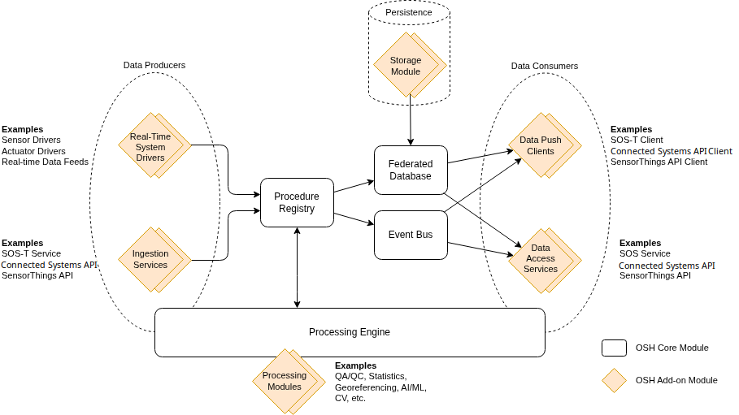

## Overview
**OpenSensorHub** is designed around a modular architecture, with components referred to as **modules**.
These OSH modules are different to Gradle modules, yet we typically use Gradle modules to encapsulate additional OSH (hence `osh-addons`) modules for dependency and build management.

If we refer back to the general architecture diagram, you can see that there a few types of core modules that drive the main features of **OpenSensorHub**.



## Module Registry
The OSH central module registry or `ModuleRegistry` is an implementation of the `IModuleManager` interface.

`IModuleManager` allows the implementation of a manager class that manages modules of the same type.

Through a node's central module registry (`ModuleRegistry`), we are able to manage all modules (`IModule`) handled by the OSH node.

See `ModuleRegistry`'s <a href="/reference/javadoc/org/sensorhub/impl/module/ModuleRegistry.html" target="_blank">API reference</a> or continue to see examples.

## Module Providers/Descriptor
The module provider, `IModuleProvider` is an interface to package information about a module.
It provides the following:
- Descriptive information about the module (name, description, version, vendor)
- The main class implementing `IModuleBase` (base class of `IModule`)
- The main config for the module

The `IModuleProvider` provides an entrypoint for creating new modules, creating module configurations, and describing modules.

Addon modules for OSH are discovered by using the `ServiceLoader` API to load classes that extend `IModuleProvider`.
This is why you must provide a file under the `META-INF/services` resource directory named `org.sensorhub.api.module.IModuleProvider` that includes the classpath of implemented module descriptors.

## Types of Modules
When developing addons for **OpenSensorHub**, it is important to design your module to align with the role of that module's type.

Below is a list of the most common types of modules, and a description of their usage/role.

| Module Type             | Role                                                                                                                                             | Use Case                                                                                                                                                        |
|-------------------------|--------------------------------------------------------------------------------------------------------------------------------------------------|-----------------------------------------------------------------------------------------------------------------------------------------------------------------|
| Sensor/System Driver    | Convert data feeds from external formats to OSH's internal data models (System, FOI, Datastream, Observation, Command, etc.).                    | A driver is created to capture CSV data from a TCP stream. The driver converts this data into SWE Common datastreams/observations usable by other parts of OSH. |
| Database/Storage Module | Connect to any external database/storage medium, for easy plug-and-play with OSH's database engine/interface via **Federated Database**.         | A database module is created to persist OSH data models in a NoSQL database, such as MongoDB.                                                                   |
| Processing Module       | Execute processing chains for processing realtime or archived data flows into other data flows (stream of one or more OSH data feed to another). | An OpenCV processing module is created to detect and output the location of suspicious vehicles in each frame of an OSH video datastream.                       |
| Service Module          | Provide communication interfaces for exchanging data in/out of OSH node (REST APIs, pub/sub services, etc.).                                     | The Connected Systems API service module serves an instance of the Connected Systems API, which exposes OSH internal data models via a RESTful web API.         |
| Client Module           | Connect to external services for purposes of **pushing or ingesting** resources to/from those services.                                          | The SOS-T Client Push module connects to another OSH node, pushing all static and dynamic resources from the local to the remote node.                          |
| Network Module          | Provide interface for communicating data via one or more physical and transport layer.                                                           | A sensor driver requires a connection over Bluetooth, so it uses a Bluetooth Comm/Network module to interface with the Bluetooth device.                        |
| Security Module         | Provide customized security layers for fine-grained access management, or through integrating with external authentication providers.            | A security module is created providing custom permission control and authorization using OAuth.                                                                 |

## Module Configs
To be usable by **OpenSensorHub**, each module must have an associated **module config**.
This **module config** defines a set of configuration options used when the module is deployed.

**Module configs** are used to load new modules, and reload modules which have been saved to an **OpenSensorHub** node's configuration store.

```java title="ModuleConfigBase"
public abstract class ModuleConfigBase implements Cloneable
{
    /**
     * Class implementing the module (will be instantiated when module is loaded)
     */
    @DisplayInfo(label="Module Class", desc="Module implementation class")
    public String moduleClass;
    
    
    @DisplayInfo(label="Module Name", desc="User chosen name for the module")
    public String name;


    @Override
    public ModuleConfigBase clone()
    {
        return new ConfigCloner().deepClone(this);
    }
}

```

```java title="ModuleConfig"
public class ModuleConfig extends ModuleConfigBase
{   
    
    /**
     * Unique ID of the module. It must be unique within the SensorHub instance
     * and remain the same during the whole life-time of the module
     */
    @DisplayInfo(label="Module ID", desc="Unique local ID of the module")
    public String id;
    
    
    @DisplayInfo(label="Description", desc="User description for the module")
    public String description;
    
    
    @DisplayInfo(label="Auto Start", desc="Set to automatically start the module when it is loaded")
    @SerializedName(value="autoStart", alternate={"enabled"})
    public boolean autoStart = false;
    
    
    @Override
    public ModuleConfig clone()
    {
        return (ModuleConfig)super.clone();
    }
}
```

## Submodules
Submodules are modules that are loaded and managed by a parent module.
This can either be to facilitate communication, data logging, etc. for a parent module, 
or to group certain types of modules under a "system of modules", such as with the `ISystemGroupDriver`,
which groups data-producing modules.

Submodules that are dependent on parent modules may implement `ISubModule` and use a basic `SubModuleConfig`.

## Examples
Below are some examples of both usage and implementation.
### ModuleRegistry
```java
SensorHub hub = new SensorHub(); // Instance of ISensorHub includes the centralized module registry
hub.start();
ModuleRegistry registry = hub.getModuleRegistry();

// Getting list of available module providers
Collection<IModuleProvider> moduleProviders = registry.getInstalledModuleTypes();

// Creating config and loading a new module
IModuleProvider firstModuleProvider = moduleProviders.get(0);
ModuleConfig newConfig = registry.createModuleConfig(firstModuleProvider);
IModule<?> newModule = registry.loadModule(newConfig);

// Filtering loaded modules by module type 
Collection<AbstractSensorModule> sensorModules = registry.getLoadedModules(AbstractSensorModule.class);

// Changing module state
registry.initModule(newModule.getLocalID()); // Or async with `registry.initModuleAsync(newModule);`
registry.startModule(newModule.getLocalID());

// Destroying module
registry.destroyModule(newModule.getLocalID());

// Updating a module's current config
ModuleConfig config = newModule.getConfiguration();
config.name = "New Name";
registry.updateModuleConfigAsync(newModule, config);
```
### IModuleProvider
```java
public class FakeWeatherModuleDescriptor implements IModuleProvider {
  @Override
  public String getModuleName() {
    return "Fake Weather Sensor";
  }

  @Override
  public String getModuleDescription() {
    return "Fake weather station with randomly changing measurements";
  }

  @Override
  public String getModuleVersion() {
    return "1.0";
  }

  @Override
  public String getProviderName() {
    return "Botts Innovative Research, Inc.";
  }

  @Override
  public Class<? extends IModule<?>> getModuleClass() {
    return FakeWeatherSensor.class;
  }

  @Override
  public Class<? extends ModuleConfig> getModuleConfigClass() {
    return FakeWeatherConfig.class;
  }
}
```
### Existing Base Modules
`osh-core` provides a variety of pre-existing implementations of the module and submodule interfaces.
Some common base modules include:
- `AbstractModule` - The most basic implementation of `IModule`, providing helpful methods for module management
- `AbstractSubModule` - The most basic implementation of `ISubModule`
- `AbstractSensorModule` - Easy-to-use class for creating a sensor/system driver.
- `AbstractProcessModule` - Easy-to-use class for creating a processing module.