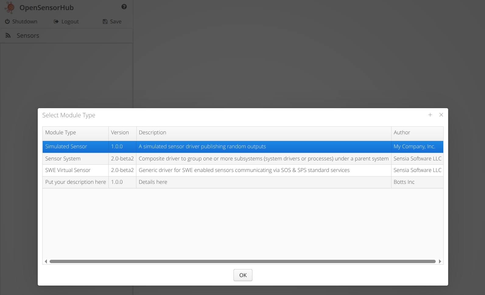

# Creating a Driver
This guide will show an example of creating your own **Simulated Weather Sensor Driver**.

In this example, you will use the driver template provided to replicate a **Simulated Weather Sensor Driver**.

## Prerequisites
It is highly recommended to use an IDE such as IntelliJ IDEA or Eclipse.
IDEs often have great Gradle integration which eases the configuration and build process for your project.

Please make sure you are familiar with OSH through either the [Quickstart Guide](../../quickstart/requirements.md),
or follow the specialized guide to retrieving and learning about the [OSH Node Development Template](../dev-template.md).

It is also highly recommended you check out the dissection of the [Driver Template](driver-template.md).
## Copy the Template
First, we will make a copy of the driver template, and give it a unique name. 
Since our driver will be simulated, we can simply name this `sensorhub-driver-simulated`.


## Add to Build Configuration
In order to use IDE features such as code completion, syntax highlighting, and debugging capabilities, make sure Gradle recognizes your driver module.
### Project Settings
If the driver is not already added to the project-level `settings.gradle`, such as through the following code block, then you will need to add it manually.
```gradle title="/osh-node-dev-template/settings.gradle"
FileTree subprojects = fileTree("$rootDir/sensors").include('**/build.gradle')
subprojects.files.each { File f ->
    File projectFolder = f.parentFile
    if (projectFolder != rootDir) {
        String projectName = ':' + projectFolder.name
        include projectName
        project(projectName).projectDir = projectFolder
    }
}
```
Or, if you need to manually add this module to your `settings.gradle` (only if above is not present):
```gradle title="/osh-node-dev-template/settings.gradle
include 'sensorhub-driver-simulated'
project(':sensorhub-driver-simulated').projectDir = "$rootDir/sensors/sensorhub-driver-simulated" as File
```
:::tip
Your IDE should hint that the module is a Gradle project.
This means that the module is recognized through the project-level `settings.gradle`.
Below shows the blue icon in IntelliJ IDEA which means the module is recognized.

Please refresh Gradle or "Sync All Gradle Projects" if the module is included but not recognized.


:::

### Project Build Configuration
Once you have verified that your module is included as a Gradle subproject, 
add it to the project-level `build.gradle` as shown by the highlighted line below.

```gradle title="/osh-node-dev-template/build.gradle"
...
dependencies {
  implementation 'org.sensorhub:sensorhub-core:' + oshCoreVersion
  implementation 'org.sensorhub:sensorhub-core-osgi:' + oshCoreVersion
  implementation 'org.sensorhub:sensorhub-datastore-h2:' + oshCoreVersion
  implementation 'org.sensorhub:sensorhub-service-swe:' + oshCoreVersion
  implementation 'org.sensorhub:sensorhub-webui-core:' + oshCoreVersion
  implementation 'org.sensorhub:sensorhub-service-consys:' + oshCoreVersion
  implementation project(':sensorhub-driver-template')
  // highlight-next-line
  implementation project(':sensorhub-driver-simulated')
...
```

## Update Names
Now that the module has been included in our project's build configuration, we can move on to customizing this template.
### Package Names
Please provide a logical package name for your module.
For this example, I will use the package name `com.mycompany.impl.sensor.simulated`, representing some abstract company.

It is important to update this package name in a few different places.
- In all Java files (including test classes), so their declared package is accurate.
- In the `osgi` task of the module's `build.gradle`, under the `Bundle-Activator` attribute.
- In the META-INF/services file `org.sensorhub.api.module.IModuleProvider`, to reflect the new path of the `Descriptor` class.

Below is an example of some locations for the package name changes.


### Gradle
A few lines must be changed in your module's `build.gradle` to describe the module, and to credit developers and/or organizations for distribution.

The highlighted lines below show some custom information provided for this simulated weather driver.

```gradle title="../sensorhub-driver-simulated/build.gradle"
// highlight-start
description = 'Simulated Weather Sensor' // Name of driver/module
ext.details = "A simulated sensor driver publishing random weather outputs" // Details about the module
// highlight-end
version = '1.0.0' // You may also provide module versioning here

...
...

// add info to OSGi manifest
osgi {
    manifest {
    // highlight-next-line
        attributes ('Bundle-Vendor': 'My Company, Inc.')
        attributes ('Bundle-Activator': 'com.mycompany.impl.sensor.simulated.Activator')
    }
}

// add info to maven pom
ext.pom >>= {
    developers {
        developer {
    // highlight-start
            id 'johndoe123'
            name 'John Doe'
            organization 'My Company, Inc.'
            organizationUrl 'https://mycompany.com'
        // highlight-end
        }
    }
}

```
### Readme
Be sure to include up-to-date information regarding your driver in a README.md file.

Some information includes (but not limited to):
- Supported models compatible with the driver
- How to configure the driver/module
- Common errors/troubleshooting
## Modify Code
Now, we can modify the template code to create a **Simulated Weather Sensor Driver** based on this template driver.

We will start with the data structure in our `Output` class.
### Output
A few things need to be specified in our `Output` class.
- **Output Name, Label, Description**
- **Output Data Structure/Encoding**
- **Method to Publish Data**

We'll start with the first two edits.
#### Description, Structure, Encoding
Below shows our updated `Output`'s descriptive information, as well as some common weather station observations in our output data structure.
```java title="sensorhub-driver-simulated/src/main/java/com/mycompany/impl/sensor/simulated/Output.java"
public class Output extends AbstractSensorOutput<Sensor> {
    // highlight-start
    static final String SENSOR_OUTPUT_NAME = "simWeatherOutput";
    static final String SENSOR_OUTPUT_LABEL = "Simulated Weather Output";
    static final String SENSOR_OUTPUT_DESCRIPTION = "Data from a simulated weather station";
    // highlight-end
    
    private static final int MAX_NUM_TIMING_SAMPLES = 10;

    private final ArrayList<Double> intervalHistogram = new ArrayList<>(MAX_NUM_TIMING_SAMPLES);
    private final Object histogramLock = new Object();
    private final Object processingLock = new Object();

    private DataRecord dataRecord;
    private DataEncoding dataEncoding;

    Output(Sensor parentSensor) {
        super(SENSOR_OUTPUT_NAME, parentSensor);
    }

    void doInit() {
        // Get an instance of SWE Factory suitable to build components
        GeoPosHelper sweFactory = new GeoPosHelper();

        // Create the data record description
        dataRecord = sweFactory.createRecord()
                .name(SENSOR_OUTPUT_NAME)
                .label(SENSOR_OUTPUT_LABEL)
                .description(SENSOR_OUTPUT_DESCRIPTION)
                .addField("sampleTime", sweFactory.createTime()
                        .asSamplingTimeIsoUTC()
                        .label("Sample Time")
                        .description("Time of data collection"))
                // highlight-start
                .addField("temperature", sweFactory.createQuantity()
                        .definition(SWEHelper.getPropertyUri("AirTemperature"))
                        .label("Air Temperature")
                        .uomCode("Cel"))
                .addField("pressure", sweFactory.createQuantity()
                        .definition(SWEHelper.getPropertyUri("AirPressure"))
                        .label("Air Pressure")
                        .uomCode("hPa"))
                .addField("windSpeed", sweFactory.createQuantity()
                        .definition(SWEHelper.getPropertyUri("WindSpeed"))
                        .label("Wind Speed")
                        .uomCode("m/s"))
                .addField("windDirection", sweFactory.createQuantity()
                        .definition(SWEHelper.getPropertyUri("WindDirection"))
                        .label("Wind Direction")
                        .uomCode("deg")
                        .refFrame(SWEConstants.REF_FRAME_NED, "Z"))
                .build();
        // highlight-end

        // highlight-next-line
        dataEncoding = sweFactory.newTextEncoding(",", "\n"); // We can keep this as our data is easily text encoded
    }
...
```
#### Publishing Observations
Now, we can update our `setData()` method using our newly defined data format.

The highlighted portions show the new parameters for our `setData()` method,
and the use of those parameters to update and publish a `DataBlock`.
```java title="sensorhub-driver-simulated/src/main/java/com/mycompany/impl/sensor/simulated/Output.java"
// highlight-next-line
public void setData(long timestamp, double temp, double press, double windSpeed, double windDir) {
    synchronized (processingLock) {
        DataBlock dataBlock = latestRecord == null ? dataRecord.createDataBlock() : latestRecord.renew();

        updateIntervalHistogram();

        // Populate the data block
        dataBlock.setDoubleValue(0, timestamp / 1000d);
        // highlight-start
        dataBlock.setDoubleValue(1, temp);
        dataBlock.setDoubleValue(2, press);
        dataBlock.setDoubleValue(3, windSpeed);
        dataBlock.setDoubleValue(4, windDir);
        // highlight-end
        
        // Publish the data block
        latestRecord = dataBlock;
        latestRecordTime = timestamp;
        // highlight-next-line
        eventHandler.publish(new DataEvent(latestRecordTime, Output.this, dataBlock));
    }
}
```
### Sensor
In the `Sensor` class, we must modify the default UID prefixes to accurately describe our sensor driver.

#### UIDs
The highlighted portions below show the edited prefixes for the UID and XML ID, 
and the lines which generate the IDs using the prefixes and a `serialNumber` field from the `Config` class.
```java title="sensorhub-driver-simulated/src/main/java/com/mycompany/impl/sensor/simulated/Sensor.java"
public class Sensor extends AbstractSensorModule<Config> {
    // highlight-start
    static final String UID_PREFIX = "urn:osh:sensor:simulated:";
    static final String XML_PREFIX = "SIMULATED_SENSOR_";
    // highlight-end

    private static final Logger logger = LoggerFactory.getLogger(Sensor.class);

    Output output;
    Thread processingThread;
    volatile boolean doProcessing = true;

    @Override
    public void doInit() throws SensorHubException {
        super.doInit();

        // Generate identifiers
        // highlight-start
        generateUniqueID(UID_PREFIX, config.serialNumber);
        generateXmlID(XML_PREFIX, config.serialNumber);
        // highlight-end
        
        // Create and initialize output
        output = new Output(this);
        addOutput(output, false);
        output.doInit();
    }
...
```
#### Getting Data
For this example, we'll create random measurements within a certain range.

The setup:
```java title="sensorhub-driver-simulated/src/main/java/com/mycompany/impl/sensor/simulated/Sensor.java"
...
Random random = new Random();
double[] tempRange = {20.0, 40.0};
double[] pressureRange = {1000.0, 1050.0};
double[] windSpeedRange = {0.0, 5.0};
double[] windDirectionRange = {0.0, 360.0};

private double getRandomDoubleInRange(double min, double max) {
    return random.nextDouble() * (max - min) + min;
}
...
```

The updated processing thread showing randomly generated data values which are sent to our `Output` instance.
```java title="sensorhub-driver-simulated/src/main/java/com/mycompany/impl/sensor/simulated/Sensor.java"
public void startProcessing() {
    doProcessing = true;

    processingThread = new Thread(() -> {
        while (doProcessing) {

            // highlight-start
            double temp = getRandomDoubleInRange(tempRange[0], tempRange[1]);
            double press = getRandomDoubleInRange(pressureRange[0], pressureRange[1]);
            double windSpeed = getRandomDoubleInRange(windSpeedRange[0], windSpeedRange[1]);
            double windDir = getRandomDoubleInRange(windDirectionRange[0], windDirectionRange[1]);
            // highlight-end
            
            // Simulate data collection and processing
            // highlight-next-line
            output.setData(System.currentTimeMillis(), temp, press, windSpeed, windDir);

            // Simulate a delay between data samples
            try {
                Thread.sleep(100);
            } catch (InterruptedException e) {
                Thread.currentThread().interrupt();
            }
        }
    });
    processingThread.start();
}
```
### Unit Tests
Make sure to test your code!
Writing unit tests is the easiest way to verify that parts of your code function as intended.

Please see [Testing Guide](../unit-testing.md) for information and examples of unit tests using JUnit.

In order to run the current unit tests for this module, we'll need to edit some tests with expected values / method changes.

Feel free to include extra unit tests!
```java title="/sensorhub-driver-simulated/src/test/java/com/mycompany/impl/sensor/simulated/OutputTest.java"
public class OutputTest extends TestBase {
    @Test
    public void getRecordDescription() {
        assertTrue(output.getRecordDescription() instanceof DataRecord);

        // Verify that the output's record description has the expected properties.
        var recordDescription = (DataRecord) output.getRecordDescription();
        assertEquals(Output.SENSOR_OUTPUT_NAME, recordDescription.getName());
        assertEquals(Output.SENSOR_OUTPUT_LABEL, recordDescription.getLabel());
        assertEquals(Output.SENSOR_OUTPUT_DESCRIPTION, recordDescription.getDescription());

        // Verify that the record description contains the expected fields.
        assertNotNull(recordDescription.getField("sampleTime"));
        assertEquals("Sample Time", recordDescription.getField("sampleTime").getLabel());
        assertEquals("Time of data collection", recordDescription.getField("sampleTime").getDescription());

        // highlight-start
        assertNotNull(recordDescription.getField("temperature"));
        assertNotNull(recordDescription.getField("pressure"));
        assertNotNull(recordDescription.getField("windSpeed"));
        assertNotNull(recordDescription.getField("windDirection"));
        // highlight-end
    }
    ...

    @Test
    public void setData() {
        sensor.stopProcessing();

        // highlight-start
        // Set some sample data.
        long sampleTime = System.currentTimeMillis();
        double temp = 20;
        double press = 1000;
        double windSpeed = 2;
        double windDirection = 235;
        output.setData(sampleTime, temp, press, windSpeed, windDirection);
        // highlight-end
        
        // Get the latest record and pair it with the record description for data access.
        DataBlock latestRecord = output.getLatestRecord();
        DataComponent recordDescription = output.getRecordDescription().copy();
        recordDescription.setData(latestRecord);

        // highlight-start
        // Verify that the latest record contains the expected data.
        assertEquals(sampleTime / 1000d, recordDescription.getComponent("sampleTime").getData().getDoubleValue(), 0.001);
        assertEquals(temp, recordDescription.getComponent("temperature").getData().getDoubleValue(), 0.001);
        assertEquals(press, recordDescription.getComponent("pressure").getData().getDoubleValue(), 0.001);
        assertEquals(windSpeed, recordDescription.getComponent("windSpeed").getData().getDoubleValue(), 0.001);
        assertEquals(windDirection, recordDescription.getComponent("windDirection").getData().getDoubleValue(), 0.001);
        // highlight-end
    }
}
```

## Build Project
Now, execute the Gradle `build` task either in your IDE, or through the command line using `./gradlew build`.

:::info
Gradle `build` task in IntelliJ IDEA:


:::

This build process will fail if any of your unit tests fail.
If you choose to build without testing, you may run `./gradlew build -x test`.

:::warning
pay attention to errors, see docs page about common errors and troubleshooting
:::

## Debugging
If you wish to debug your module without having to build a `.zip` distribution every time, 
please see the [Debugging Guide](../debugging.md)

## Test the Sensor
Time to check out our new driver!

I'll quickly run through steps to check that your driver is working.
If you get stuck building/launching/configuring, reference the [Quickstart Build Guide](../../quickstart/build.md),
[Quickstart Deployment Guide](../../quickstart/deploying.md),
and [User Documentation](../../user-docs/sensors-and-process-modules.md)

1. Unzip the freshly built OSH node in `/osh-node-dev-template/build/distributions`.
2. Launch the node with the `launch.bat` or `launch.sh` script.
3. Checkout the Admin UI at `http://localhost:8181/sensorhub/admin` (username: `admin`, password: `admin`).
4. Add a new **Sensor** module, ensuring that your new module exists.


5. Configure your driver and start it.
6. Check that the driver is publishing outputs.

Below we can see that the driver is successfully publishing random weather observations, so the driver is working!

