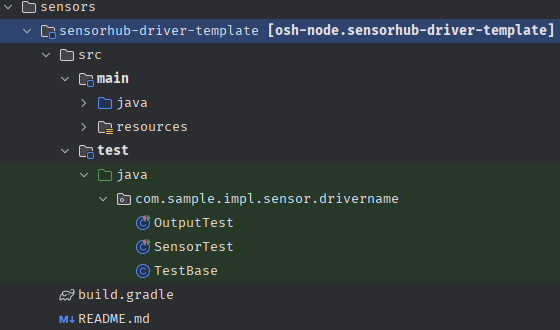

# Testing
## Overview

**OpenSensorHub** uses Gradle for automating builds, as well as testing.

When performing a default build of **OpenSensorHub** using

```gradle
./gradlew build
```
, you will see Gradle run all tests that are defined in each Gradle module's `test` task.
Most **OpenSensorHub** modules will simply use the **JUnit** platform for testing.

## Examples

Inside the `osh-node-dev-template` project, you will see a template sensor driver under
`/osh-node-dev-template/sensors/sensorhub-driver-template`




Here we can see an example of how to set up basic **JUnit** test classes.

### Testing Environment
```java title="../sensorhub-driver-template/src/test/java/com/sample/impl/sensor/drivername/TestBase.java"
...
public class TestBase {
    Sensor sensor;
    Output output;

    //highlight-next-line
    @Before // Here we can define what happens before each unit test
    public void init() throws Exception {
        Config config = new Config();
        config.serialNumber = "123456789";
        config.name = "Sensor Template";
        config.description = "Description of the sensor";
        sensor = new Sensor();
        sensor.init(config);
        sensor.start();
        output = sensor.output;
    }

    //highlight-next-line
    @After // Here we can define what happens after each unit test
    public void cleanup() throws Exception {
        if (null != sensor) {
            sensor.stop();
        }
    }
}
```

As shown, you can annotate initialization methods that run *before* unit tests using `@Before`, and cleanup methods that run *after* unit tests using `@After`.

These are important for setting up your testing environment, and making sure you clean up resources or background processes.

### Gradle Test Dependencies

Should you need any other modules for your testing environment, you can include them in your module's `build.gradle` under dependencies with `testImplementation` or `testCompileOnly`:

```gradle title="../sensorhub-my-module/build.gradle"
dependencies {
    implementation 'org.sensorhub:sensorhub-core:' + oshCoreVersion
    ...
    testImplementation('junit:junit:4.13.1') // Default
    // highlight-start
    testImplementation project('...')
    testImplementation('...')
    testCompileOnly project('...') // Use testCompileOnly for dependencies that are not needed at runtime
    testCompileOnly('...')
    // highlight-end
}
```

### Unit Tests
From our template sensor driver's test classes, we can see how to write basic unit tests with **JUnit**.

```java title="../sensorhub-driver-template/src/test/java/com/sample/impl/sensor/drivername/SensorTest.java"
...
public class SensorTest extends TestBase {
    @Test
    public void testSensor() {
        assertTrue(sensor.isStarted());
        assertTrue(sensor.isConnected());

        assertEquals(Sensor.UID_PREFIX + "123456789", sensor.getUniqueIdentifier());
        assertEquals("Sensor Template", sensor.getName());
        assertEquals("Description of the sensor", sensor.getDescription());
    }
}
```

This class shows an example of a basic unit test, annotated with `@Test`, which will run with our `init()` before, and `cleanup()` after, from our `TestBase` class.

This specific test will ensure that our sensor has started and has the correct UID, name, and description.

While this is a basic example of a test, I highly encourage you to reference the `osh-core` APIs under *Developer Documentation* to create robust unit tests and test environments. Nearly any mundane test you can perform by-hand in **OpenSensorHub**'s web-based Admin UI can be performed programmatically.