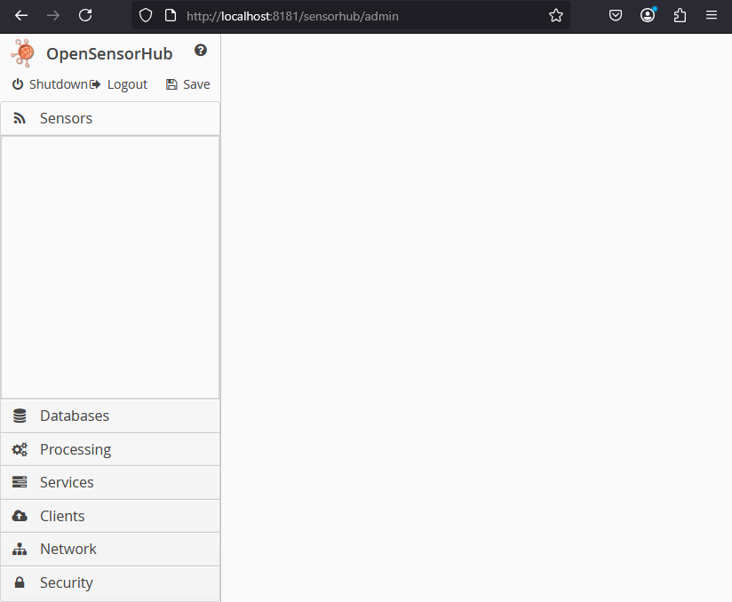

# Deploying an OSH Node

## Basic Deployment

After building the node, you can navigate to the newly generated ``` /osh-node-dev-template/build/distributions``` directory.

You will see the `osh-node-..*.zip`

Unzip the node. Within the extracted folder execute the launch script for your corresponding OS by either double-clicking or running the script in the command line:
:::note

**Windows**: 

``` cmd 
./launch.bat
```
**Linux / MacOS (Shell)**:
``` cmd
 ./launch.sh
```
:::

To test that the OSH server is running, you can visit [`http://localhost:8181/sensorhub/test`](http://localhost:8181/sensorhub/test), or by visiting the Admin UI.

Open your web browser and navigate to [`http://localhost:8181/sensorhub/admin`](http://localhost:8181/sensorhub/admin)


### Default OSH Configuration
With the deployment package, there is a `config.json` file containing a default configuration of **OpenSensorHub**. Within this configuration, only default users and service modules are configured. 

:::info
The default administrative credentials are:

**username**: admin

**password**: admin
:::

Below is an example of what you should see in the **OpenSensorHub** Admin UI. 

We will cover using/deploying the different modules under *User Documentation*, with API reference available in the *Developer Documentation*.



## Docker Deployment

TBD