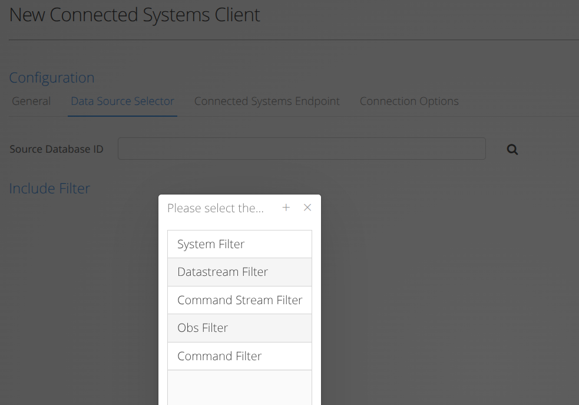
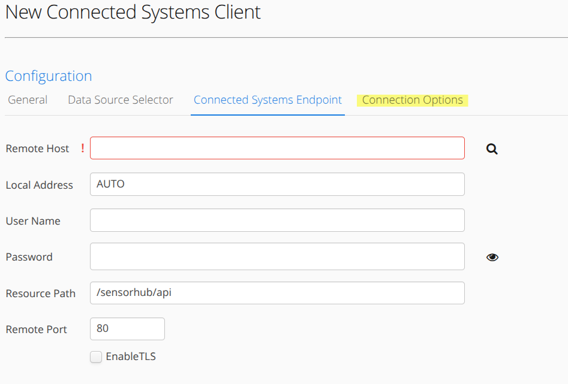

# Client Modules
**OpenSensorHub** facilitates node-to-node communication with *Client Modules*.
The pre-packaged *Client Modules* included in an **OpenSensorHub** build are the *Connected Systems API Client* and the *SOS-T Client*.

Both of these *Client Modules* work in virtually the same way.
> 1. Establish a connection to a remote service (typically hosted by another **OpenSensorHub** node)
> 2. Insert or update all static resources (selected in the *Data Source* configuration) into the remote service.
> 3. Use subscriptions to the selected systems to continuously insert observations from data streams, or commands from control streams, into the remote service.

Basically, a *Client Module* is used to insert data into another **OpenSensorHub** node, using the corresponding service hosted on the remote **OpenSensorHub** node.

A *Connected Systems API Client* will insert data through a remote node's *Connected Systems API Service*, while an *SOS-T Client* will insert data through a remote node's *SOS Service*.

:::note
Since *Connected Systems API Client* and *SOS-T Client* use standard requests from **OGC API - Connected Systems** and **Sensor Observation Service (SOS)**, respectively, 
these *Client Modules* can be used to insert data from an **OpenSensorHub** node into **ANY** server which conforms to the corresponding service.
:::

## Configuration
The pre-packaged *Client Modules* are by far the easiest module to configure, as they only require connection settings and a specified data source;
**OpenSensorHub** will take care of the rest.

### Data Source
*Client Modules* use the same method in which *Service Modules* use to expose their resources, by choosing a database and/or filtering for certain resources.

If no database is selected, and no filter is created, the *Client Module* will send **ALL** data available in the *Federated Database* to the remote service.

### Connection
The connection settings for a *Client Module* are straightforward, and are used to establish and maintain a connection to the remote service.

Additional connection settings are available such as timeout and number of reconnect attempts in the final configuration tab (highlighted).

## Other Client Modules

While the pre-packaged *Client Modules* are currently the only *Client Modules* available from **OpenSensorHub**'s public repositories, 
other *Client Modules* may be used/created for the purposes of both sending data to a service via a common API, or even **ingesting** data from a service.