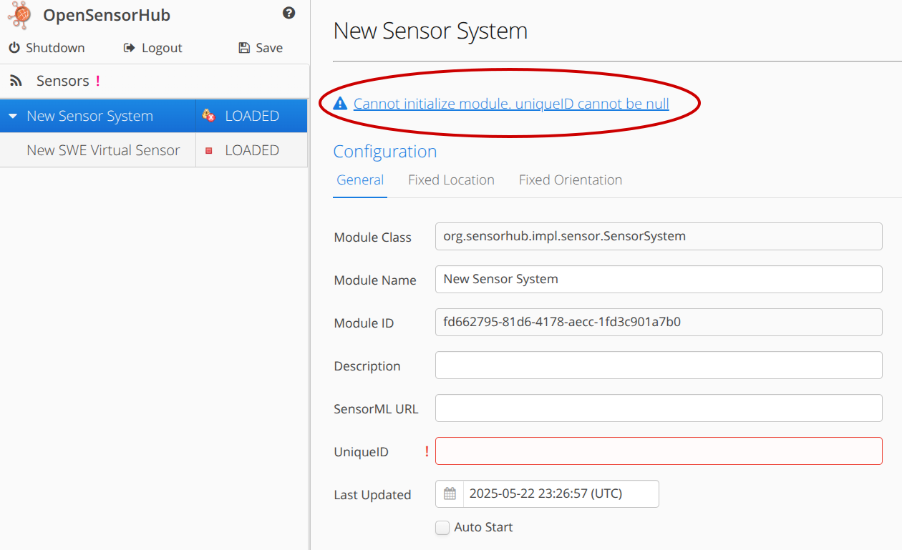
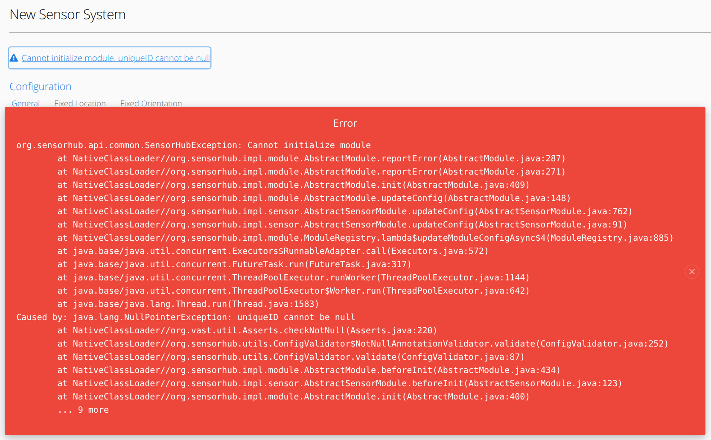

# Logging

Logging is crucial if something goes wrong, to understand exactly **what** went wrong, **when** it went wrong, and **where** it happened.

**OpenSensorHub** logs errors and other messages both behind the scenes, and in the web-based admin interface.

## Admin UI

Summaries of both error messages and status messages will appear at the top of each module.

If you see in the sidebar that a module has thrown an error, please select that module and view the summary at the top.

In this instance, our module failed to initialize because I did not specify a *Unique ID* in the configuration.



If you want a more detailed description of the error, or stack trace, you can click on the error summary to bring up the stack trace, which is always fully logged in the terminal, as well.



## Log Files
By default, `DEBUG` and higher-severity log messages will be enabled and printed in the terminal when running an **OpenSensorHub** node.
However, you are able to configure which log levels are printed in both the terminal and persistent log files.
### logback.xml
In your **OpenSensorHub** node, `/osh-node-*.*.*/config/logback.xml` will contain configuration for terminal and persistent logging.

Below, you will see the default `logback.xml` file. Here, you have the option to change the level of printed log messages, where the logs are saved, size of logs, etc.

```xml title="/osh-node-*.*.*/config/logback.xml"
<?xml version="1.0" encoding="UTF-8"?>
<configuration>
  
  <!-- general logging in console -->
  <appender name="STDOUT" class="ch.qos.logback.core.ConsoleAppender">
    <encoder>
      <pattern>%d{yyyy-MM-dd HH:mm:ss.SSS} %-5level %logger{0} [%thread] - %msg%n</pattern>
    </encoder>
  </appender>
  
  <!-- individual module log files -->
  <property name="MODULE_ID" value="${MODULE_ID:-.}" />
  <appender name="MODULE_FILE" class="ch.qos.logback.core.rolling.RollingFileAppender">
      <file>.moduledata/${MODULE_ID}/log.txt</file>
    <rollingPolicy class="ch.qos.logback.core.rolling.SizeAndTimeBasedRollingPolicy">
      <fileNamePattern>.moduledata/${MODULE_ID}/log.%d{yyyy-MM-dd}.%i.txt</fileNamePattern>
      <maxFileSize>10MB</maxFileSize>
      <maxHistory>30</maxHistory>
      <totalSizeCap>100MB</totalSizeCap>
    </rollingPolicy>
    <encoder>
      <pattern>%d{yyyy-MM-dd HH:mm:ss.SSS} %-5level [%thread] - %msg%n</pattern>
    </encoder>
  </appender>
  
  <root level="debug">
    <appender-ref ref="STDOUT" />
  </root>
    // highlight-next-line
  <logger name="org.sensorhub" level="debug">
    <appender-ref ref="MODULE_FILE" />
  </logger>
  <logger name="org.eclipse.jetty" level="warn" />
  <logger name="org.vast" level="warn"/>
  
</configuration>
```
### Historic Logs

By default, logs will be stored in a hidden `.moduledata` directory at the root of your node.
In this directory, you will find a single `log.txt` which contains the latest logs from all modules.
You will also find several other directories, labeled by their corresponding module ID; these are for individual module log files.

