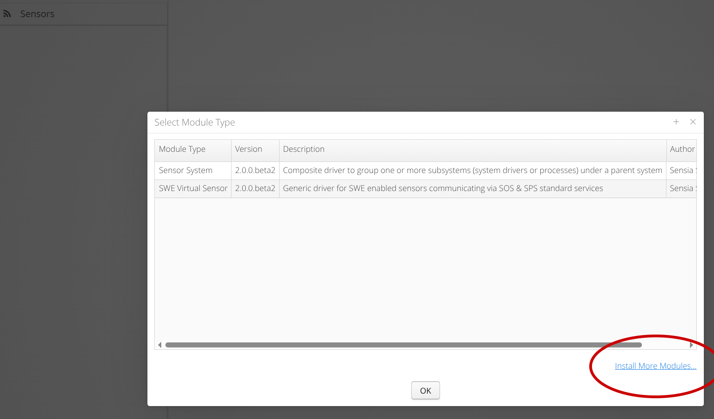
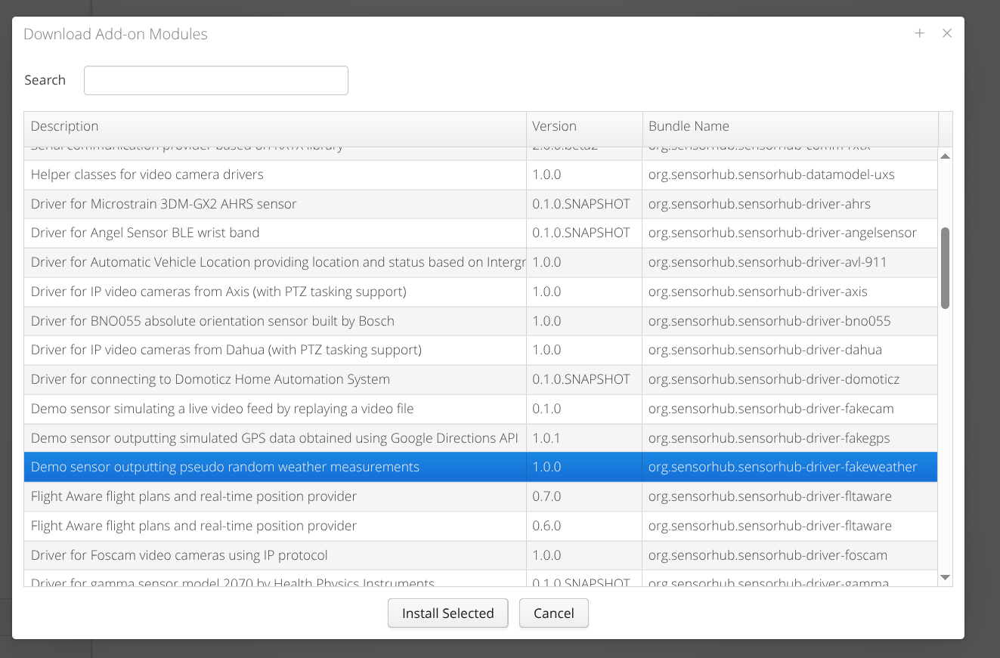
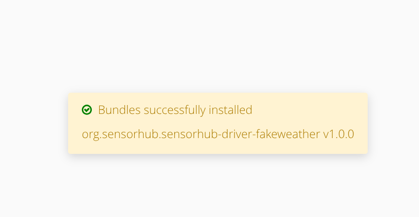
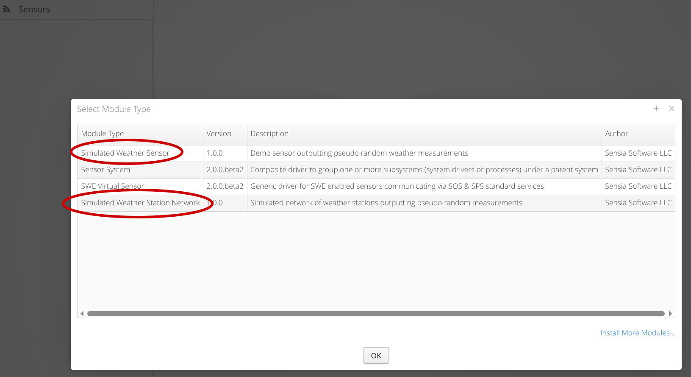

# OSGi

## Overview

**OSGi** is used in **OpenSensorHub** as a way of enabling dynamic installation of OSH modules (sensor drivers, processes, database modules, etc.). 
In the OSH OSGi environment, an OSH node will have access to a **bundle repository**, from which the OSH node can download additional modules, as **OSGi bundles**.
This **bundle repository** is simply a file server that hosts all the bundles as **JAR** files, with an index file which lists descriptive information about each bundle.

OSH nodes can be launched with OSGi, which allows 2 significant operations for the node.

- The AdminUI is configurable with a `bundleRepositoryURL` option, where you can add URLs of bundle repositories.
- When a URL is added, you will be able to download additional modules from the repository via the AdminUI.

:::info
The easiest way to check if OSGi is enabled for your OSH node is to "Add a New Module," and check for the "Install More Modules" button as shown in [Installing Modules](#installing-modules)
:::

## AdminUI Configuration

OSH node configuration file (`config.json`) with a configured bundle repository.
```json title="config.json"
{
  "objClass": "org.sensorhub.ui.AdminUIConfig",
  "id": "7219eb9f-b591-4c2c-9ad9-4b63a29a1c4a",
  "moduleClass": "org.sensorhub.ui.AdminUIModule", 
  // highlight-start
  "bundleRepoUrls": [
    "https://cloud.georobotix.io/addons/index.xml"
  ],
  // highlight-end
  "autoStart": true
}
```

## Installing Modules

When clicking "Add New Module" in any of the OSH tabs, the typical module selection popup will appear, but with a button in the bottom-right corner to "Install More Modules".



From this module installation menu, we can select from a list of modules hosted on the **bundle repository**, and install them to our OSH node.



Once a module is installed, you should see a notification about the successful installation. Click the notification to dismiss it.



Then, your installed module should appear in the list of modules when you "Add a New Module."
As we can see below, the installed module added 2 new drivers to our node.

