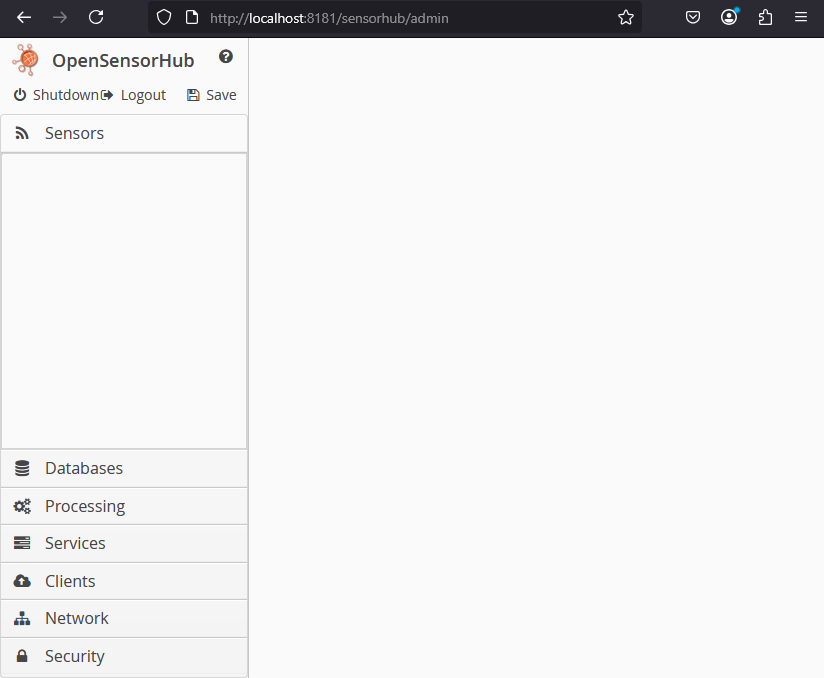
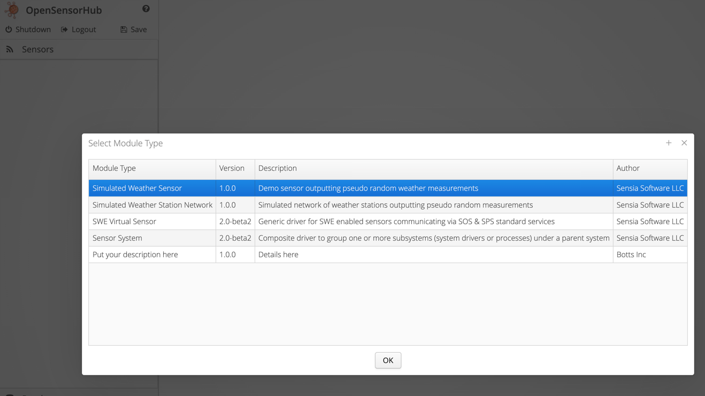

 
# Sensor and Process Modules

Sensors and processes are at the core of **OpenSensorHub**'s ability to deploy and use inputs and outputs of physical and non-physical sensors, systems, processes, etc.

*Sensor Drivers* and *SensorML Processes* both utilize SensorML and SWE Common Data Modeling to describe systems, features of interest, data streams, commands, controls, and more. 

## Sensors

**OpenSensorHub** uses *Sensor Drivers* to act as a bridge between a physical sensor (or non-physical stream of data) and **OpenSensorHub**'s inner workings.

*Sensor Drivers* allow us to do the following
- Persist data via **OpenSensorHub**'s database engine for long term storage
- Serve sensor data or actuator inputs via **OGC API - Connected Systems**
  - This acts as an easy-to-use interface to create client applications to visualize sensor data
- Connect sensor output streams or actuator inputs to be used in SensorML process chains
- Capture sensor data to push to other **OpenSensorHub** nodes via OSH client modules
- Group sensor outputs and metadata via Sensor Systems
                                                         
### Selecting a Sensor Driver

The easiest way to deploy *Sensor Drivers* is to use the Admin UI.
The Admin UI is available by default on all **OpenSensorHub** nodes at 
```
{protocol}://{host}:{port}/sensorhub/admin
```
On a local **OpenSensorHub** node, this will typically be 
```http
http://localhost:8181/sensorhub/admin         
```

:::info
**OpenSensorHub** nodes are password protected.

The default Admin UI credentials:
**username**: admin
**password**: admin
:::



On the Admin UI, if you right-click the space under the *Sensors* tab, and select *Add New Module*, you can add a new *Sensor Driver* from a list of all *Sensor Drivers* that have been included in your **OpenSensorHub** build.

In this example, I'll select and show the outputs of a simulated weather sensor.


:::tip
This specific driver can be found in `osh-addons/sensors/simulated/sensorhub-driver-fakeweather` which is pre-packaged in 
[`osh-node-dev-template`](https://github.com/opensensorhub/osh-node-dev-template). 
Or, you can add it to your own node by pulling the latest [`osh-addons`](https://github.com/opensensorhub/osh-addons) repository.
Please see the quickstart guide on [*Build Configuration*](../quickstart/build-configuration)
:::

### Configuring Sensor Drivers
After you've selected a *Sensor Driver*, you'll see a panel to configure this driver. The driver will also appear under the *Sensors* tab with the `LOADED` state. 
Here you can edit information required for describing your driver such as a name, description, unique ID, as well as an actual SensorML description of the sensor, if applicable.


Almost all *Sensor Drivers* will include important configuration options for establishing a connection to the sensor, configuring parameters, describing the sensor's location, etc. 
Make sure that you provide accurate and up-to-date configuration to ensure a connection is made to your sensor.

Once you are happy with the *Sensor Driver*'s configuration, select *Apply Changes* at the top-right of the panel, and your *Sensor Driver* will initialize with the provided configuration.


### Module Actions

For any **OpenSensorHub** module, you can control its state in the Admin UI by right-clicking the module on the sidebar, and selecting an action.


| Action           | Usage/Purpose                                                                                                                                                                   |
|------------------|---------------------------------------------------------------------------------------------------------------------------------------------------------------------------------|
| *Start*          | Starts the selected module. For *Sensor Drivers*, this will start the data stream of sensor outputs from the sensor to OSH's internal event bus.                                |
| *Stop*           | Stops the selected module. For *Sensor Drivers*, this will close the connection to the sensor, and stop the sensor from publishing data to OSH.                                 |
| *Force Init*     | Re-initializes the module, setting it to `INITIALIZED` state. Typically, you use this to clear up issues that prevented the module from starting under its previous conditions. |
| *Remove Module*  | Completely removes the module from **OpenSensorHub**. Persisted data will not be removed when performing this action. Please see [*Databases*](databases.md).                   |
| *Add New Module* | Allows you to add a new module of the type for whichever sidebar tab you are in. (Sensors, Databases, Processes, etc.)                                                          |

### Sensor Driver's Outputs

To check that your *Sensor Driver* is publishing outputs, you can check under the *Outputs* section that appears under the *Sensor Driver's* configuration, once initialized.


You may also check the *Federated Database* under the *Databases* tab, to check that your *Sensor Driver* is publishing its latest outputs to the **OpenSensorHub** State Database.


### Sensor Driver's Commands

Some *Sensor Drivers* will have *Control Streams* in addition to their output *Data Streams*. These *Control Streams* act as an interface for sending commands to a sensor or actuator.

If your *Sensor Driver* has *Control Streams*, you will see a user interface for sending commands under a *Sensor Driver*'s *Outputs* section.

### Sensor Systems

**OpenSensorHub** has a built-in *Sensor* module that acts as a parent to a group of *Sensor Drivers* and/or *Processing Modules*. This can be useful for deployments where multiple *Sensor Drivers* and/or *Processing Modules* must be linked to a common parent.


We will walk through setting up a basic *Sensor System*.


A *Sensor System* is configured like all other **OpenSensorHub** modules. While it is necessary to provide a unique ID, you may optionally provide additional descriptive information such as the *Sensor System*'s location, orientation, and SensorML description.

Once configured, you may add *Sensor Drivers* and *Process Modules* under a *Sensor System* by right-clicking the *Sensor System* and selecting *Add Submodule*.


A *Sensor System*'s children can be configured as if they were standalone modules. Below, you can see a *Sensor System* with 2 simulated weather *Sensor Drivers*. 

:::info
Submodules may not be started unless the parent *Sensor System* is started. Also, if submodules have `autoStart` enabled, then they will start once the parent *Sensor System* is started.
:::


## Processing

### SensorML Stream Processing

SensorML Stream Processing can be used to connect sensor outputs/commands, and other processes' outputs/commands. 
This allows for complex calculations and automations to be done on the fly.

Currently, **OpenSensorHub** comes pre-packaged with a *SensorML Stream Process* module, accessible under the *Processing* tab. 
In order to run this processing module, you will need to provide a *SensorML Process Description*, which should be provided in a `.xml` or `.json` file. 
Please review the *Developer Documentation* for developing processes and describing their execution with a *SensorML Process Description*.


For the sake of this example, I will load a preconfigured simulated weather process which you can find at

`/osh-node-dev-template/include/osh-addons/processing/sensorhub-process-fakeweather`

This Gradle module provides you with a test class that will print a process description to your console in XML and JSON.
After putting this process description in a file and loading it into the *SensorML Stream Process* module, we can see a stream of the process' outputs, similar to a *Sensor Driver*.

