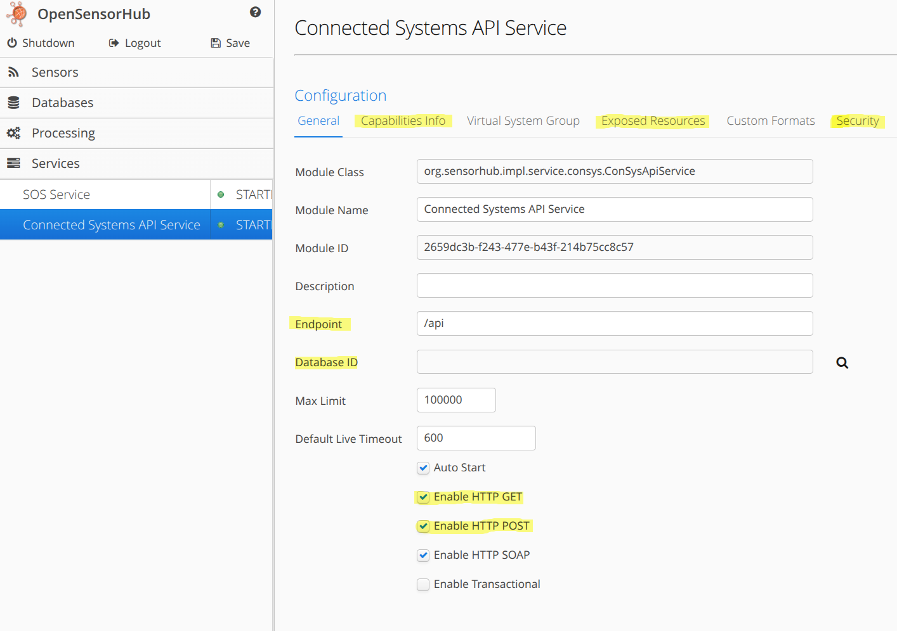
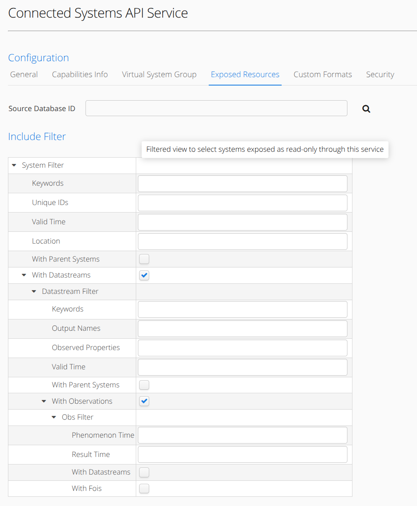
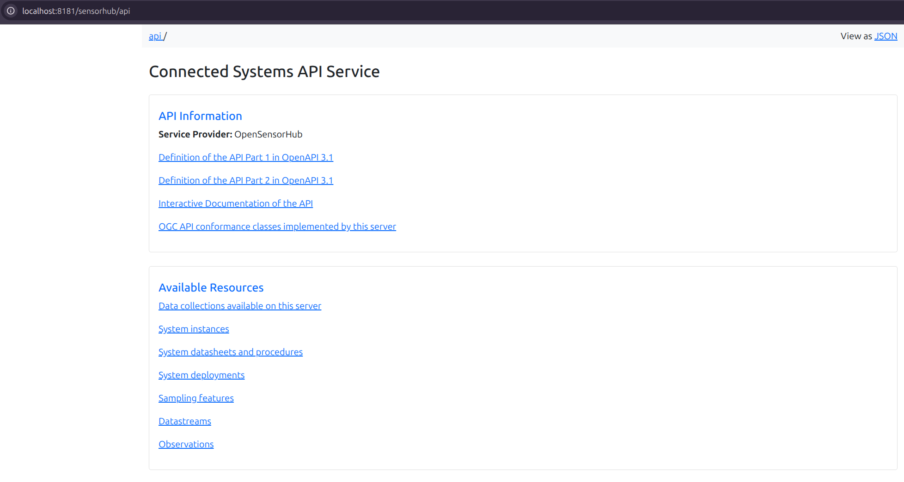
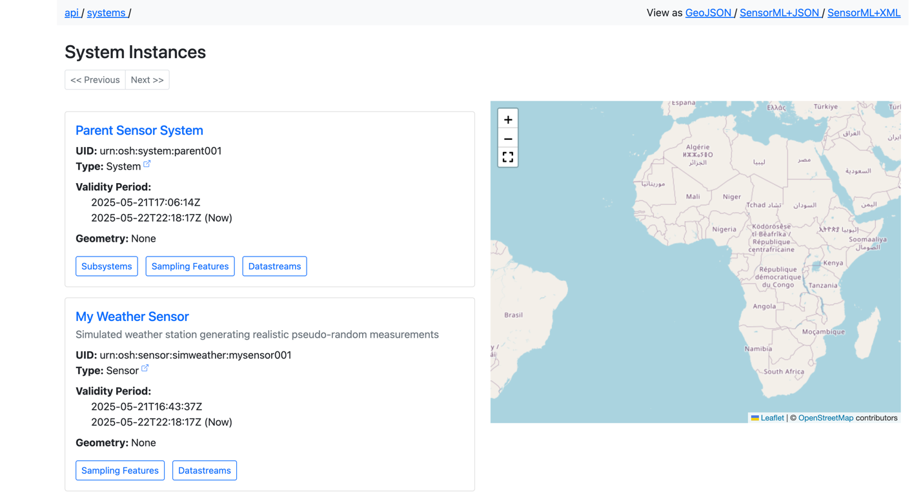

# Service Modules

Service modules in **OpenSensorHub** are typically used to expose resources via a standard method of communication. 
**OpenSensorHub** exposes resources most commonly through a REST API, or via streaming protocols such as MQTT, etc. 

The default *Service Modules* packaged in an **OpenSensorHub** node are *Connected Systems API Service*, *SOS Service*, and *SPS Service*.

While *SOS Service* and *SPS Service* are mostly deprecated, the *Connected Systems API Service* is the newest and most up-to-date common *Service Module*.

The *Connected Systems API Service Module* allows an **OpenSensorHub** node to expose its resources on a configurable endpoint via **OGC API - Connected Systems**.
:::tip
You can learn more about **OGC API - Connected Systems** [here](https://ogcapi.ogc.org/connectedsystems/) or refer to the **OSH Connect** [documentation](../../osh-connect/introduction) for building **OpenSensorHub** clients using **OGC API - Connected Systems**.
:::
This guide will cover basic configuration of only the *Connected Systems API Service Module*, but you will find that most service modules have similar configuration.

## Connected Systems API Service

The *Connected Systems API Service* exposes a REST API which conforms to **OGC API - Connected Systems**.

By default, this API is hosted at `/sensorhub/api`, but this can be configured in the *Connected Systems API Service Module*.

Below are highlighted configuration sections that may be useful in configuring the *Connected Systems API Service*

### Using a Database
By default, the *Connected Systems API Service* will not be attached to any specific database, but will use **OpenSensorHub**'s default state database.
If clients try to `POST` resources to your **OpenSensorHub** node via the *Connected Systems API*, you will likely see these resources appear in the *Federated Database* (if systems/datastreams/observations), 
but they will not persist upon shutting down the node.

In order to persist resources that are inserted via the *Connected Systems API*, you must attach a database to this *Service Module* through the configuration (*Database ID* field). 
The attached database can be a simple *H2 Historical Obs Database*.
As long as the database is running, resources will be persisted. 

### Exposed Resources

The *Exposed Resources* configuration enables filtering of what resources are accessible through this service.

By default, *Exposed Resources* uses no filtering, which means that **ALL** resources in the *Federated Database* will be accessible through the *Connected Systems API Service*.

This configuration allows us to filter by resources in a certain database, or through the use of different **OpenSensorHub** filters.
You may provide a filter to only expose certain *Systems*, *Data Streams*, *Observations*, *Features*, etc. 

Below shows a tree containing different filters editable in the web interface.

### Security

The *Security* configuration features two key options.

The first option is to enable access control, which allows the use of granular permissions that are configurable in the *Users* security module under the *Security* tab. 

The second option is to require authentication for this service. If this is enabled, clients may only connect to your service if authenticated via **OpenSensorHub**'s security module.
This just means that clients sending requests to your *Connected Systems API* service will need to include user authentication in request headers.

### API Web Interface

**OpenSensorHub** has an easy-to-navigate web interface for its *Connected Systems API Service*.
If you go to the endpoint at which the *Connected Systems API* is being served, you are greeted with a web interface which allows you to explore resources on the node, namely *Systems*, *Data Streams*, *Observations*, *Sampling Features*, etc.

If you would like to learn more about how to understand and use the *Connected Systems API*, please refer to the **OSH Connect** [documentation](../../osh-connect/introduction.md), as well as the **OGC API - Connected Systems** [website](https://ogcapi.ogc.org/connectedsystems/). 

Clicking any of the hyperlinks under the *Available Resources* section will take you to the associated collection of resources, conformant to the **OGC API - Connected Systems** specification.

Below is an example of the `/sensorhub/api/systems` web interface.

## Other Service Modules

Feel free to check out the *Service Modules* available in **OpenSensorHub**'s collection of module addons ([`osh-addons`](https://github.com/opensensorhub/osh-addons/tree/master/services)).

You will find addons for serving data via **OGC SensorThings API**, **OGC API - Moving Features**, **MQTT Services**, and more.