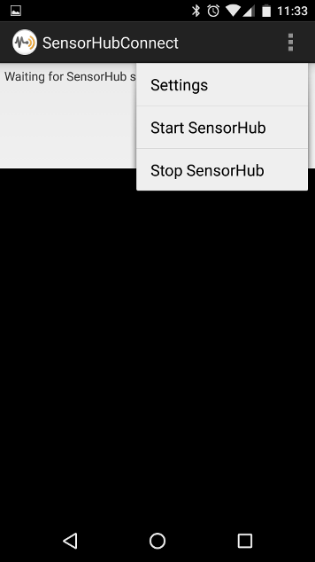
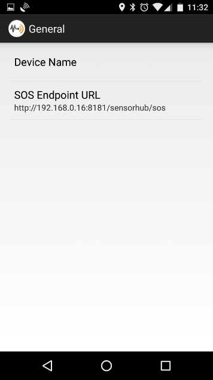
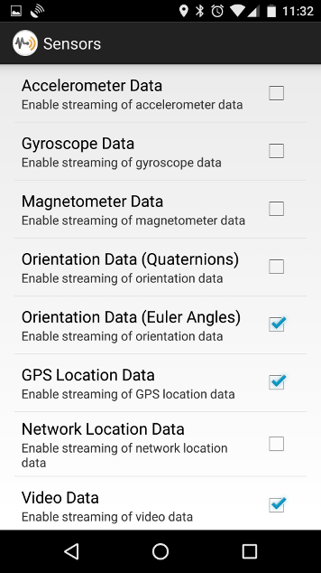
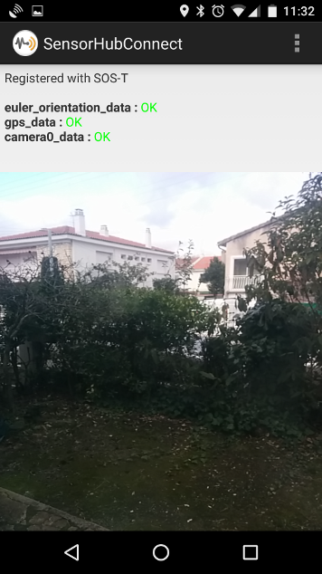

OpenSensorHub on Android
===

The core modules of OpenSensorHub (OSH) can run natively on Android 6.0 ("Marshmallow") and later versions (support for older versions of Android has been dropped since v1.3.2).

Android support is still experimental at this stage although it is already functional to send phone sensor data to a remote OSH node.

The Android specific part is composed of a Service component that wraps the OSH engine and an demo application that can be configured to send data from one or more phone sensors to the SOS server of a remote OSH node. 
 

### Android Service

Android distribution for OpenSensorHub will come as an Android service that any app can connect to and configure with the desired modules.

An app will then be able to connect directly to OpenSensorHub object model and access any part of it (e.g. sensors, processes, services, communication networks, etc.). Thus apps provide view and control over the OSH engine and can be highly customized to the user need.

We intend on making the service accessible by several apps concurrently.

### Demo Android App

The demo android app is an example of how to connect to the service, configure it and display information from it. This particular app allows uploading data collected by the phone to a remote SOS-T endpoint, and can be configured to enable/disable what sensors are used. Below are some screenshots of the app in action.

You first access the main menu (left) and configure your device name and the SOS endpoint (right):

&nbsp;&nbsp;&nbsp;&nbsp;&nbsp;

&nbsp;

You then select sensors you want to enable (left), and after you start SensorHub from the main menu, their data is streamed to the SOS (right):

&nbsp;&nbsp;&nbsp;&nbsp;&nbsp;

 

