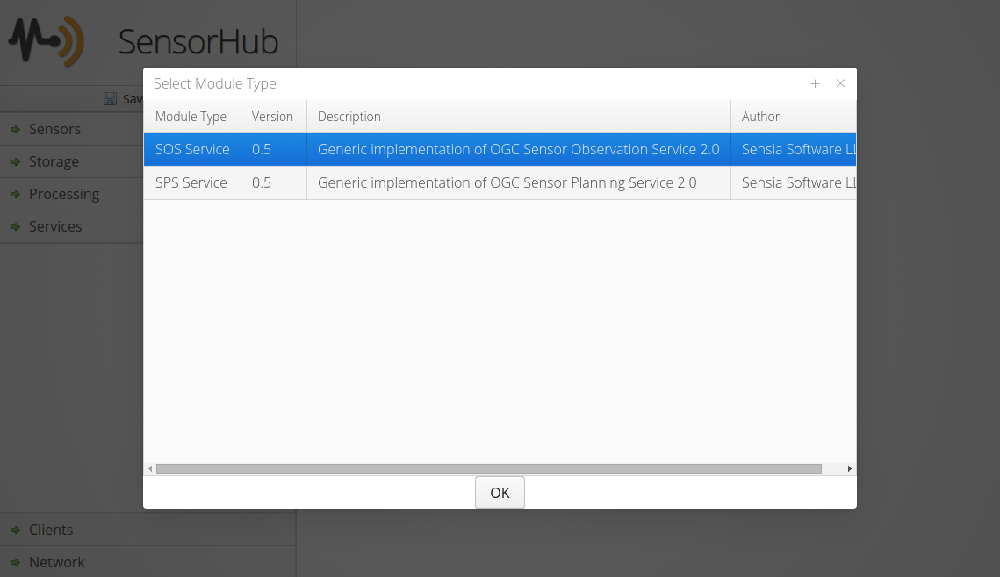
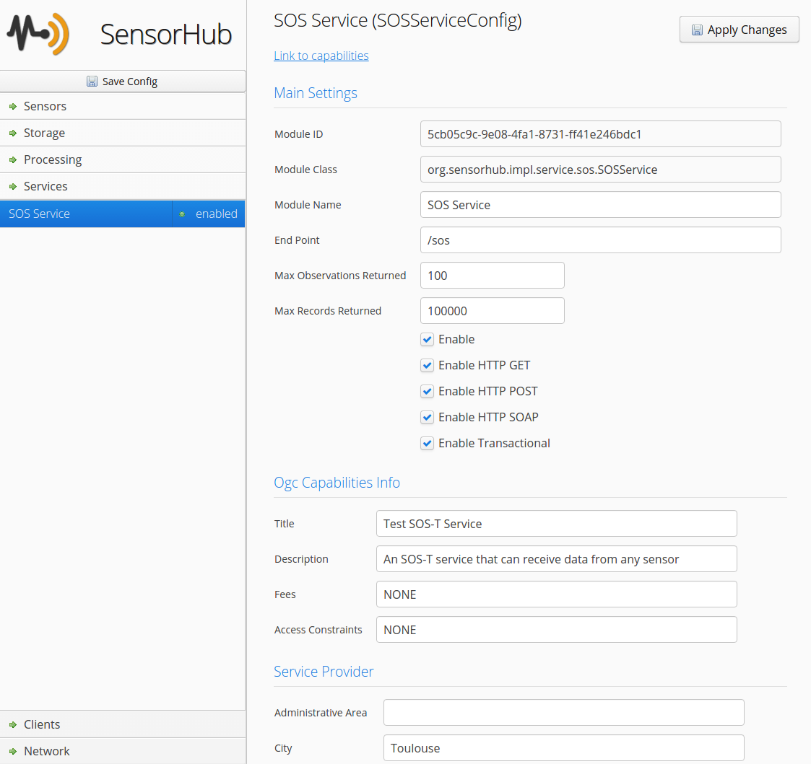

Sensor Observation Service (SOS)
===

The **Sensor Observation Service (SOS)** is an OGC standard allowing to retrieve sensor observations as well as associated metadata, such as the full sensor description in **SensorML** format.

This service is a core component of OpenSensorHub and can be configured to expose any live data stream (i.e. output of sensor or process) as well as content of any data storage available within an OSH node. It can be instantiated several times on a single node, and the user can choose which sensor data is exposed via each of these instances.
 
The main operations for data retrieval are:

* **GetCapabilities**: to retrieve general server capabilities and the list of data offerings
* **GetObservation**: to retrieve full Observation objects in XML format
* **GetResult**: to retrieve a compact data stream
* **GetResultTemplate**: to get the description of the compact data stream
* **DescribeSensor**: to get the sensor description
* **GetFeatureOfInterest**: to get the list of features observed by a given sensor

The **SOS Interface** can also be used in a transactional mode to send new observations to an OSH node. The following operations are used for insertion:

* **InsertSensor**: to insert sensor metadata and create the corresponding offering
* **InsertObservation**: to insert complete observation objects with all the related metadata
* **InsertResult**: to insert compact measurement records (previously described with InsertResultTemplate)
* **InsertResultTemplate**: to insert the description of compact measurement records

Please see the [OGC® Sensor Observation Service Interface Standard v2.0](http://www.opengeospatial.org/standards/sos) for more details.


### Setting up with the Web Admin

Adding one or more SOS endpoints is very easy through the [Web Admin](../web-admin.md). 

##### Right click in the **Services** section and select **SOS Service** in the popup window



##### Proceed to configuring SOS options

You must set the end point, and can add offerings at the bottom



For each offering, one can publish data for a sensor with or without its associated storage by using a **Sensor Data Source**. If a storage is attached, both live and historical data from that sensor are made available through the SOS interface; if not, only live data is made available.

It is also possible to create an offering that serves historical data only. In this case, a **Storage Data Source** must be used. 


### Setting up in config file

An SOS module can also be added by adding the proper JSON configuration in the main config file.

Below is an example JSON configuration of the SOS module with two offerings serving both real-time and historical data from two different sensors and their associated data storage:

```
{
    "objClass": "org.sensorhub.impl.service.sos.SOSServiceConfig",
    "id": "5cb05c9c-9e08-4fa1-8731-ff41e246bdc1",
    "name": "SOS Service",
    "moduleClass": "org.sensorhub.impl.service.sos.SOSService",
    "enabled": true,
    "endPoint": "/sos",
    "enableHttpGET": true,
    "enableHttpPOST": true,
    "enableSOAP": true,
    "dataProviders" : [
       {
           "objClass": "org.sensorhub.impl.service.sos.SensorDataProviderConfig",
           "enabled": true,
           "name": "Simulated GPS",
           "description": "Simulated GPS sensor",
           "uri": "urn:mysos:offering02",
           "sensorID": "d136b6ea-3950-4691-bf56-c84ec7d89d72",
           "storageID": "5cb05c9c-9e08-4fa1-8731-ff4ff948bdc1"
       },
       {
           "objClass": "org.sensorhub.impl.service.sos.SensorDataProviderConfig",
           "enabled": true,
           "name": "Simulated Weather",
           "description": "Simulated Weather sensor",
           "uri": "urn:mysos:offering03",
           "sensorID": "d136b6ea-3950-4691-bf56-c84ec7d89d73",           
           "storageID": "5cb05c9c-9e08-4fa1-8731-ff4ff948bdc2"
       }
    ],
    "ogcCapabilitiesInfo": {
      "title": "Test SOS Service",
      "description": "An SOS service automatically deployed by SensorHub",
      "keywords": ["SensorHub", "Video"],
      "fees": "NONE",
      "accessConstraints": "NONE",
      "serviceProvider": {
        "individualName": "Alex Robin",
        "organizationName": "Sensia Software LLC",
        "positionName": "Engineer",
        "voiceNumbers": ["+33 5 23 56 89 78"],
        "faxNumbers": ["+33 5 23 56 89 77"],
        "deliveryPoints": ["12 rue Voltaire"],
        "city": "Toulouse",
        "administrativeArea": null,
        "postalCode": "30000",
        "country": "France",
        "emails": ["admin@mydomain.com"],
        "website": null,
        "hoursOfService": null,
        "contactInstructions": null
      }
    }
  }
```
