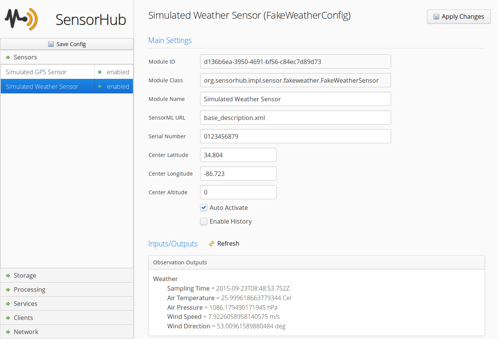
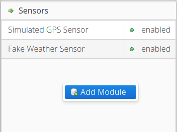
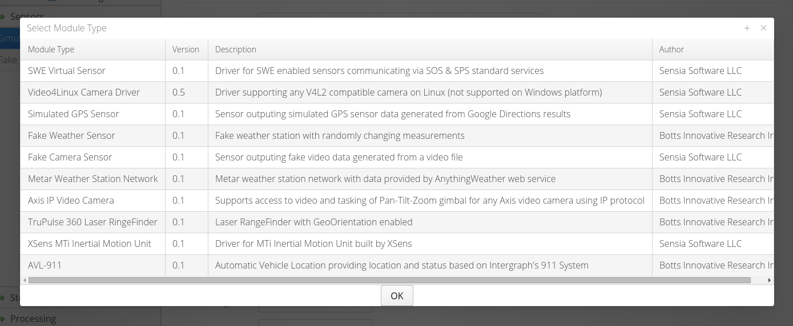

Web-Admin User Interface
===

The web based administration interface allows to change the configuration of all modules in OpenSensorHub. It can be secured or even completely disabled in the configuration file manually. If enabled, it is accessible on the local node at the following URL:

<http://localhost:8181/sensorhub/admin>

Below is a screenshot of the user interface showing configuration settings for the simulated GPS sensor (used for testing).

### Adding Modules

Most installed modules for which code has been installed can be instantiated using the interface. This is done by simply right clicking in one of the appropriate section (i.e. one of the panels in the accordion on the left), and selecting "Add Module". For example, let's add a new sensor driver module:

You will then be presented with a choice of installed modules that can be instantiated on the current node. The list will only show the modules whose type can be added in the current section. In our example, we see all sensor drivers currently available on our node since we clicked in the "Sensors" section.

Once the module is added, it's configuration form is automatically shown on the right and you can start changing its parameters.

### Configuring Modules

To configure a module, simply select it on the left panel (after opening one of the main sections), and make the desired changes in the form that is displayed on the right. Once you're done, apply your changes, click the "Apply Changes" button. This makes the changes in the actual module configuration and, if the module handles configuration updates properly, the new configuration should be immediately reflected by the running module.

### Starting and Stopping Modules

Modules are started and stopped by right clicking on the module in the left panel and selecting "Enable" or "Disable" respectively.

### Securing Access

**TODO**
