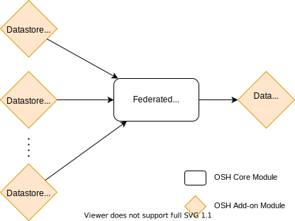
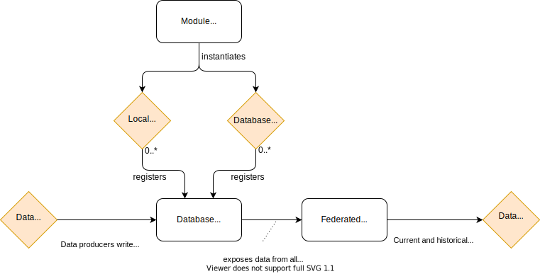

# Federated Database

The **federated database** is a central OSH component that allows aggregating multiple storage types and make them accessible to other hub components via a unified interface.

This means OSH can be configured to store data from different sensors in different **datastores** and still provide a unified view of all data collected. This is particularly useful for aggregating data from several OSH nodes into some sort of central catalog and is shown conceptually on the following diagram:

**Datastore** is meant here in the general sense of the term, so it can be any type of persistent store, including but not limited to relational databases, object databases, data repositories accessed remotely via web services, files on a filesystem, etc.

## Database Registry

The **database registry** manages all persistence modules loaded on an OSH hub. It then instantiates a **federated database** facade to provide a unified access to all persistent data and act as a mediator between historical data producers and consumers. This is shown on the figure below:

For this integration to be possible, each module implementing a database, whether it is a local database (e.g. embedded database) or a connector to a remote database (e.g. )

## Federated Identifiers

When several datastores are used together, each of them typically generates its own unique IDs (i.e. primary keys) separately, so there is no guarantee that these IDs are unique globally. In order to avoid potential ID conflicts, the **federated database** must thus provide a way to generate its own identifiers and guarantee their uniqueness.

This is done by assigning each database a number in OSH and letting the **database registry** and the **federated database** handle the mapping between public IDS and internal IDs.

Public IDs are the only ones visible and used by data consumers. All queries sent to the **federated database** must use these public IDs.

Internal IDs are the ones used inside each datastore. 

## Database Registration

Each database module must be registered to the OSH **Database Registry** for it to be exposed by the Federated Database. The registry also provides a mechanism to quickly assigns
