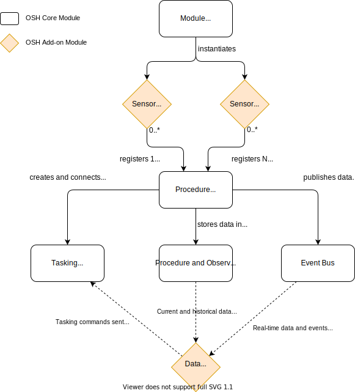

# Procedure Registry

The **procedure registry** is one of the main components of OSH middleware, whose purpose is to manage all **procedures** (i.e. sensors, actuators, processes...) connected to the hub via **device or system drivers** or other OSH modules. The diagram below gives an overview of the interactions that exist between the procedure registry and other OSH components:

In short, a system driver (or other module) can register one or more **procedure** descriptors with the registry that, in turns, exposes them to other OSH components via the **event bus** and the **federated database** interfaces. Once a **procedure** is successfully registered and enabled, device drivers can start publishing **data records** and other events on their **output channels** and receive **commands** on their **tasking channels**.

### Registration

**System drivers** typically create one or more stateful Java objects that represent **procedures** (i.e. that extend the [IProcedureDriver][IProcedureDriver] interface). These objects need to be registered before the associated data and metadata can become available to other OSH components.

For backward compatibility with v1 drivers, the registration is done automatically for drivers that implement the [IProcedureDriver][IProcedureDriver] interface themselves but has to be done explicitely by the driver implementation in all other cases. 

When a **procedure** is registered, the procedure registry connects it automatically to the **event bus**, its associated **database** and **tasking queues**, so that it becomes immediately available for other OSH components to make use of.

::: tip EXAMPLES
A **standalone sensor** driver creates a single procedure object, and optionally a single feature of interest.

An **homogeneous sensor network** (or sensor array) driver will typically register one procedure and many features of interest associated to it.

An **heterogeneous sensor network** driver may produce several procedures, each with a separate feature of interest.
:::

### Event Dispatching

The registry forwards all valid events produced by the driver to the event bus so that other modules can receive notifications in real-time

::: tip MIGRATION FROM V1
Prior to OSH v2, other OSH modules had to retrieve information directly from the sensor drivers themselves. In v2 forward, there should be **NO MORE DIRECT ACCESS TO SENSOR DRIVERS OR OTHER DATA SOURCES**.

The recommended approach is now for all modules to access procedure & obs data through the **procedure registry**, **federated database** and **event bus** instead.
:::

[IProcedureRegistry]: (@javadoc/org/sensorhub/api/procedure/IProcedureRegistry)
[IProcedureDriver]: @javadoc/org/sensorhub/api/procedure/IProcedureDriver

