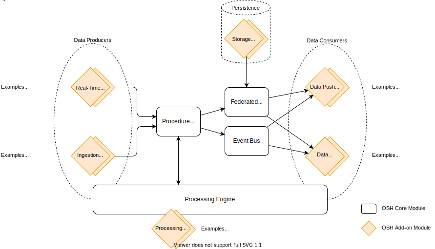

# Modular Architecture

OpenSensorHub's (OSH) **modular and flexible architecture** allows solving many different use cases related to sensor **data collection**, **harmonization**, **processing** and **distribution/sharing**.

OSH core components implement a **generic data model** and an efficient **streaming and historical data management engine** that can accomodate **any sensor type**, while **add-on modules** provide specific functionality, tailored to specific use cases or sensor kinds.

The main OSH components are shown on the following diagram:

## OSH Core Components

The following components are part of the core engine and are thus present in all OSH deployments:

#### Event Bus

The **event bus** enables **asynchronous one-to-many messaging** between components via a **publish/subscribe** paradigm. This is an essential component of OSH since many things in OSH are event-based and reactive.

#### Federated Database

The **federated database** is a **unified queryable interface** allowing access to all data stored by OSH storage modules. It allows data consumers such as services and APIs to obtain their data in a unified manner no matter what type and how many storage backends are used to persist and historize data.

All kind of storage backends are supported once a proper connector is developed. Storage types can be for example:
  - Embedded object databases (e.g. H2 MVStore, Perst)
  - SQL databases (e.g. PostgreSQL, SQLLite, Oracle)
  - Distributed NoSQL data stores (e.g. Elastic Search, MongoDB)
  - Remote datastores (e.g. proprietary web services or APIs providing access to observation archives)
  - File collections (e.g. NetCDF files)
  - etc.

#### Procedure Registry

The **procedure registry** is a management component for modules adding new [procedures][ProcedureDef] (e.g. sensors, actuators, sensor networks, processes) to an OSH hub, such a sensor drivers.

In particular, the **procedure registry** handles the following aspects:

- Procedure state management
- Validation and forwarding of events produced by data producers to the event bus
- Dispatching of new events to the event bus when state changes are detected
- Automatic persistence of real-time data (configurable)

#### Processing Engine

The **processing engine** provides functionality to **execute processing chains** in different modes:

- **Stream processing mode** to process real-time data flows (observations) into other derived data flows 
- **On-demand processing mode** to process data on-demand, when triggered by an external action (typically when requested from a service interface)
- **Batch processing mode** to process or re-process archived data in batch

Processing chains are made of atomic processing components that are provided as add-ons.

## OSH Add-ons Components

#### Real-Time System Drivers

**Real-time system drivers** are all add-ons responsible for pushing real-time (or quasi real-time) data into OSH by adapting a data feed coming from external sources. Drivers can be:

  - **Device drivers** connecting directly to a **physical device** such as a **sensor**, an **actuator**, a digital system of any kind  
  - **Data feed drivers** connecting to a network data feed in a non SWE format, e.g.
    - A Kafka feed flowing proprietary data
    - An AVL data feed over TCP produced by an existing AVL data aggregation system
    - A video data feed produced by a network camera
    - etc. 

#### Database Connectors

Any database can be used to persist data generated by OSH if the proper connector is developed. This is done by implementing the **Database API**(). Once a connector is available, observations from any sensor can be persisted and retrieved by any other module, including web service and API modules such as SOS, SensorWeb API and SensorThings API.

[ProcedureDef]: ./data-model#procedure

